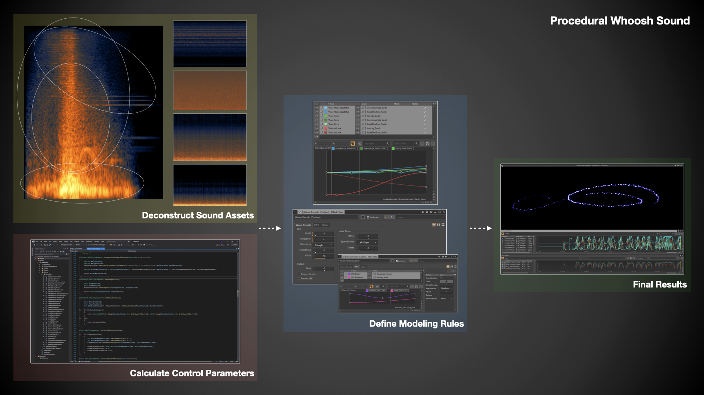
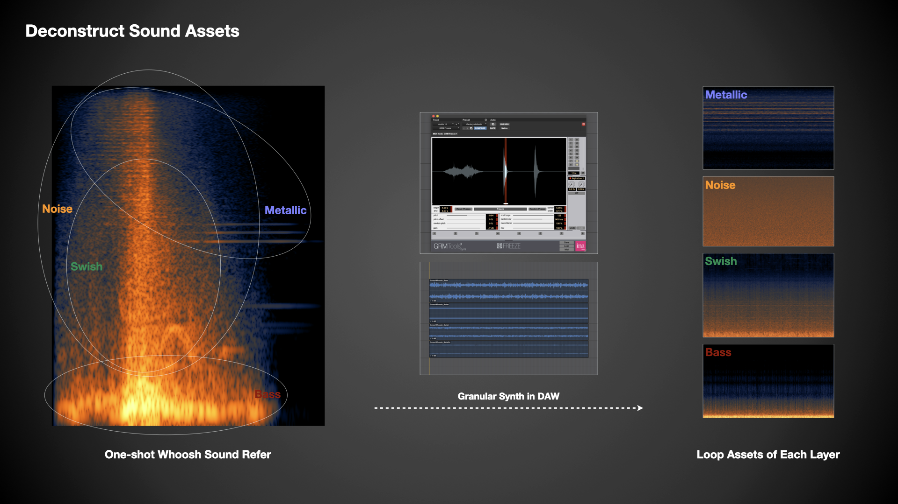
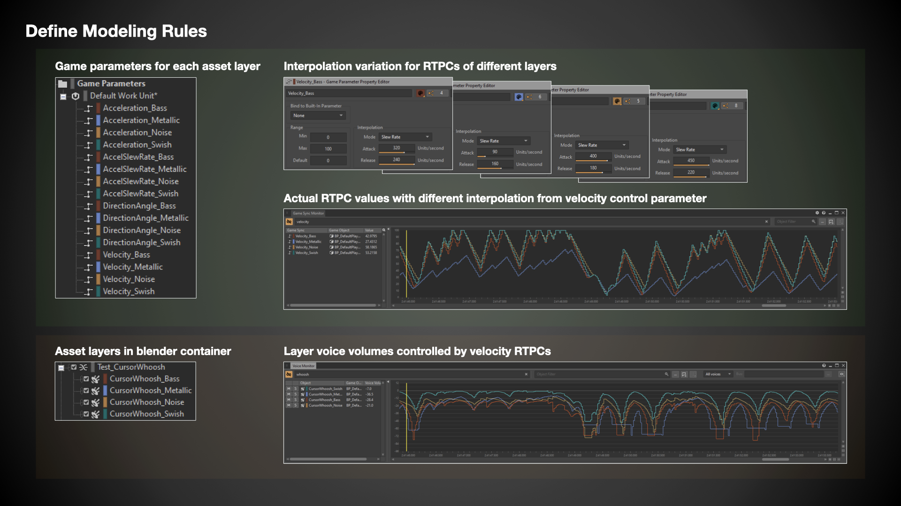
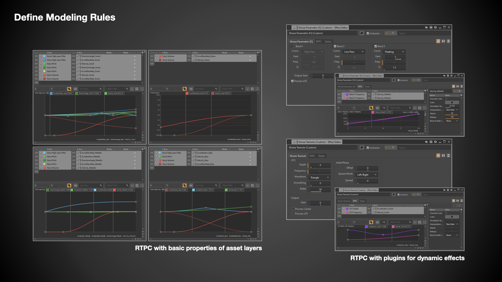

# 冷兵器 Procedural Whoosh 音频设计案例

***

<!-- Start Document Outline -->

* [Why Procedural?](#why-procedural)
* [Deconstruct Sound Assets](#deconstruct-sound-assets)
* [Calculate Control Parameters](#calculate-control-parameters)
* [Define Modeling Rules](#define-modeling-rules)
* [Conclusion](#conclusion)

<!-- End Document Outline -->

***

## Why Procedural?

目前绝大多数游戏中人物角色使用冷兵器的动作表现，几乎都是基于大量逐帧动画资源并通过不同状态来驱动切换和过渡的方式来实现的，因此冷兵器各种挥动动作的声音资源也通常是依据逐帧动画的内容来制作的，然后以与动画资源强绑定的方式来触发的。这样的设计方式能最大程度地保证动作和声音的一致性，以及声音细节表现的可塑性。  
但如果有一款游戏中允许玩家通过鼠标、手柄或者体感设备来直接高自由度地控制冷兵器的挥动，那么上述基于逐帧动画来设计声音的方式就行不通了。声音资源无法依赖确定的动画表现来制作，而是通过玩家输入的动态参数来实时生成与变化的，因此需要用一种更为 Procedural 的方式来实现相应的音频设计需求。本文将使用游戏引擎 Unreal Engine 和音频中间件 Wwise，以光标移动代表冷兵器挥动的抽象方式进行模拟，展开详述整个实现过程，分析并总结目前阶段性测试的利弊与局限。

```
Unreal Engine 4.26
Audiokinetic Wwise 2021.1.0
```

首先，有必要明确一下本文所指的 Procedural 这一概念。正如[《展望游戏音频设计的发展方向》](https://soundoer.github.io/Xichen_GADD/What-will-The-Next-Gen-of-Game-Audio-Design-be-like.html)一文中“程序化音频”章节内提到的，程序化音频的思考重点是物体为什么发声和怎么样发声，而不是简单地只考虑具体的声音表现。以相对宽泛的尺度去考量，其实目前游戏音频设计中许多基于素材并结合动态参数的设计范式都可以被称为是 Procedural 的，两个典型的例子就是汽车引擎和枪械射击。例如，汽车引擎声音的实现特点是有许多如转速之类的动态参数时刻控制着持续性声音的属性变化，枪械射击声音的实现特点则是从枪械发声部位、频段和距离等方面入手准备各个层次的声音素材。**而本文所说的 Procedural Whoosh 实现也是基于这类范式的，与汽车引擎的声音实现非常相似，对光标移动轨迹进行实时分析来获取速度、加速度和方向等之类的动态参数，用于控制 Whoosh 各个层次的声音素材的属性变化和混合过渡。**



## Deconstruct Sound Assets

冷兵器形态各异种类繁多，长度、材质和使用方式等因素都会直接影响 Whoosh 的声音表现，最终的呈现效果也会有很大程度的夸张和艺术化处理，因此可以对经过设计的 Whoosh 素材资源进行解构，分析其中包含的声音层次，并在此基础上准备相应的素材资源。

在试听大量成品素材并配合 Spectrogram 分析之后，大致可以得出规律，即一个经过设计的 Whoosh 声音可以看作是由四个部分组成的：

* **Swish**  
Whoosh 声音的主体部分，能量在频段上的不同分布能够明显体现出冷兵器在材质、形态和重量上的差异感。
* **Bass**  
能量集中的低频部分，在 Swish 主体的基础上进一步提升厚重感。
* **Noise**  
覆盖较宽频段的噪声部分，主要表现高频的嘶嘶声，还可以提供类似粘合剂的作用，顺滑地混合各个频段的声音。
* **Metallic**  
带有金属质感的高频部分，其中明显的基频与谐波成分体现了由金属材质带来的锋利感。



在频域上区分出层次之后就可以通过 Granular Synth 等方式，从已固定成型的单个 Whoosh 资源里提取并合成出频段成分稳定、长时可循环的素材了。

除此之外，各个层次在时域上也有着明显的特征，比如 Swish 持续时间较长和 Metallic 主要集中在后半段等，此类有关起止时刻和持续时间的特征也都需要在后续的实现中体现出来，也是进一步风格化设计的重要参考。

## Calculate Control Parameters

有了素材资源之后，下一步就是从光标移动轨迹入手，计算出可以用来描述光标运动特征的各种属性，也就是用于控制声音的各种动态参数。从获取光标屏幕位置开始，通过基本的算术和物理公式就可以依次计算出光标的模拟位置、方向角度、速度、加速度和加速度变化速率。


* **Position**  
对光标屏幕位置做插值平滑处理来得到其模拟位置，并通过 InterpSpeed 数值来控制处理速度，速度越快，模拟位置跟随得就越快，感觉就越跟手。另外，此数值可以进一步与冷兵器重量相关联，用于不同重量下的惯性表现。
```
void UAbilityComponent::CalculateCursorPosition(float DeltaSecond)
{
	InterpMousePositionX = FMath::FInterpTo(InterpMousePositionX, GetMousePosition().X, DeltaSecond, CursorPositionInterpSpeed);
	InterpMousePositionY = FMath::FInterpTo(InterpMousePositionY, GetMousePosition().Y, DeltaSecond, CursorPositionInterpSpeed);

	CursorPosition = FVector2D(InterpMousePositionX, InterpMousePositionY);
}
```

* **Direction Angle**  
对光标在平面上移动时的单位向量进行计算，将其转换为一维的圆心角角度，并规定0度是X轴的正轴方向。
```
void UAbilityComponent::CalculateCursorDirection(float DeltaSecond)
{
	FVector2D DeltaPositionVector = CursorPosition - CacheCursorPosition;
	FVector2D DirectionVectorUnit;
	float DirectionVectorLength;
	DeltaPositionVector.ToDirectionAndLength(DirectionVectorUnit, DirectionVectorLength);

	if (CursorVelocity != 0)
	{
		if (DirectionVectorUnit.Y >= 0)
		{
			CursorDirectionAngle = FMath::RadiansToDegrees(FMath::Acos(DirectionVectorUnit.X));
		}
		if (DirectionVectorUnit.Y < 0)
		{
			CursorDirectionAngle = 360.f - FMath::RadiansToDegrees(FMath::Acos(DirectionVectorUnit.X));
		}
	}
}
```

* **Velocity**  
计算速度并标准化成范围为0至100的参数。
```
void UAbilityComponent::CalculateCursorVelocity(float DeltaSecond)
{
	float DeltaCursorPosition = FVector2D::Distance(CacheCursorPosition, CursorPosition);
	CacheCursorPosition = CursorPosition;
	CurrentCursorVelocity = DeltaCursorPosition / DeltaSecond;

	CursorVelocity = FMath::GetMappedRangeValueClamped(CursorVelocityClampRange, FVector2D(0, 100), CurrentCursorVelocity);
}
```

* **Acceleration**  
计算加速度并标准化成范围为-10至10的参数。
```
void UAbilityComponent::CalculateCursorAcceleration(float DeltaSecond)
{
	float DeltaCursorVelocity = CurrentCursorVelocity - CacheCursorVelocity;
	CacheCursorVelocity = CurrentCursorVelocity;
	CurrentCursorAcceleration = DeltaCursorVelocity / DeltaSecond;

	CursorAcceleration = FMath::GetMappedRangeValueClamped(CursorAccelerationClampRange, FVector2D(-10, 10), CurrentCursorAcceleration);
}
```

* **Accel Slew Rate**  
计算加速度变化速率并标准化成范围为0至1的参数。此数值主要用于表征光标是否快速来回移动。
```
void UAbilityComponent::CalculateCursorAccelSlewRate(float DeltaSecond)
{
	float DeltaCursorAcceleration = FMath::Abs(CursorAcceleration - CacheCursorAcceleration);
	CacheCursorAcceleration = CursorAcceleration;
	CurrentCursorAccelSlewRate = DeltaCursorAcceleration / DeltaSecond;

	CursorAccelSlewRate = FMath::GetMappedRangeValueClamped(CursorAccelSlewRateClampRange, FVector2D(0, 1), CurrentCursorAccelSlewRate);
}
```

之后，通过 SetRTPCValue 将上述 Direction Angle、Velocity、Acceleration 和 Accel Slew Rate 四个一维参数分别同时映射到四条素材层次上，即总共会有16条 RTPC 可供使用。

另外值得一提的是，为了模拟冷兵器在真实空间中的移动效果，还可以通过反投影的方式把二维的 Cursor Position 转换为三维的 Cursor Location，并用此数值来实时更新发声点位置。

```
FVector UAbilityComponent::ScreenPositionToWorldLocation(FVector2D ScreenPosition)
{
	FVector WorldLocation;
	FVector WorldDirection;
	PlayerController->DeprojectScreenPositionToWorld(ScreenPosition.X, ScreenPosition.Y, WorldLocation, WorldDirection);

	FVector ActualWorldLocation = FVector(WorldLocation.X * PositionToWorldXYMultiplier, WorldLocation.Y * PositionToWorldXYMultiplier, PositionToWorldZOffset);
	return ActualWorldLocation;
}
```

## Define Modeling Rules

素材资源和控制参数都准备好之后，接下来就是在音频中间件 Wwise 中将两者关联起来，重构 Whoosh 声音的发声规则，主要是从以下两个方面入手。

一是 RTPC 自身对控制参数的响应。通过 Slew Rate 和 Filtering Over Time 两个 Interpolation 模式以及其中 Attack 和 Release 数值的调整，可以让各个素材的同类 RTPC 对同一个控制参数有着不同的响应表现，也就是影响了各个声音层次的 Envelope。比如，Metallic 层次 Velocity RTPC 有着较小的 Attack 和 Release 数值，可以让这层声音出现得比较慢且持续稍长一些。



二是 RTPC 对素材属性的控制。比如，Velocity 可以与 Volume 相关联，作为声音起止的主要控制参数；Direction Angle 和 Acceleration 可以与 Pitch 相关联，小幅度地调整音调产生变化感。另外还可以用来调控效果插件的参数，实现更多丰富的动态效果。比如，Metallic 层次的 Accel Slew Rate 与 Tremolo 效果器中的 Depth 和 Frequency 相关联，就可以模拟冷兵器小幅快速来回晃动时金属震颤的质感。



## Conclusion

最终效果见[视频演示](https://www.youtube.com/watch?v=5ugnB7Y7JwA)。

实际测试表明，虽然最终效果还没有达到理想中传统素材的程度，但对解决此类无法依赖逐帧动画的音频设计需求时，本文采用抽象物理参数控制分层素材资源的 Procedural Whoosh 实现方式是可行的。  
为了追求更好的表现力效果，以上实现方式在现有基础上仍有很大的扩展空间。本文仅使用单点光标作为模拟对象，可供使用的物理参数比较有限，如果使用带有陀螺仪等更精密控制的输入设备，或者对角色 Skeleton Mesh 的多个锚点进行综合计算并提取参数，那么就能有更多相关联的控制参数可供使用。当然，更多的控制参数并不一定意味着更好的效果，毕竟这与物理模拟不同，最重要的还是提取有限的关键参数来更准确直接地控制素材资源。因此相较而言，更符合声音设计逻辑的改进方式就是，从横向和纵向进一步地区分和提升素材本身的表现力。比如，根据 Velocity 数值将 Swish 层次拆分成低中高三个素材的混合，或者是准备更多的具有不同基频和谐波成分的 Metallic 层次进行叠加。总而言之，目前绝大多数的游戏音频设计实践中，在有了成熟可行的实现机制之后，最终呈现效果的优劣还是会回归到声音素材本身的质量高低上。

希辰  
2021.8.26

***