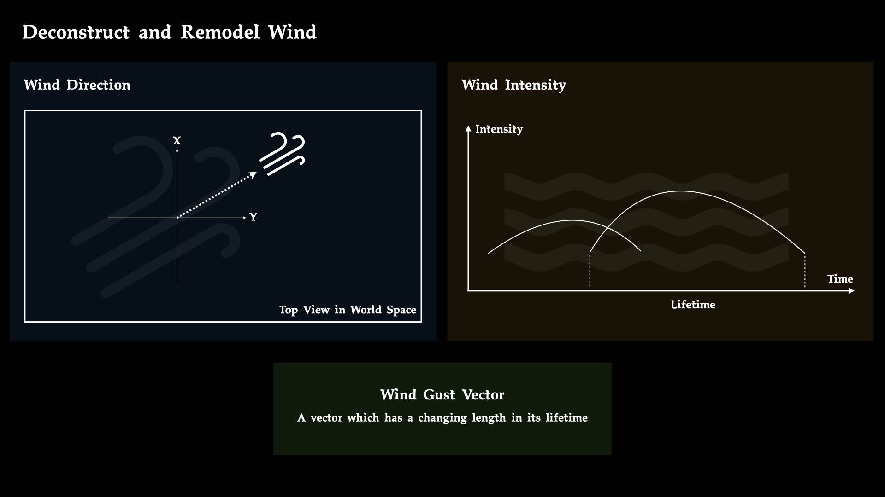
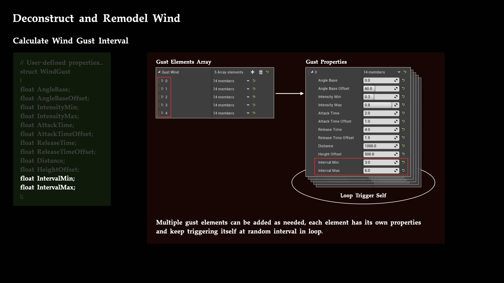
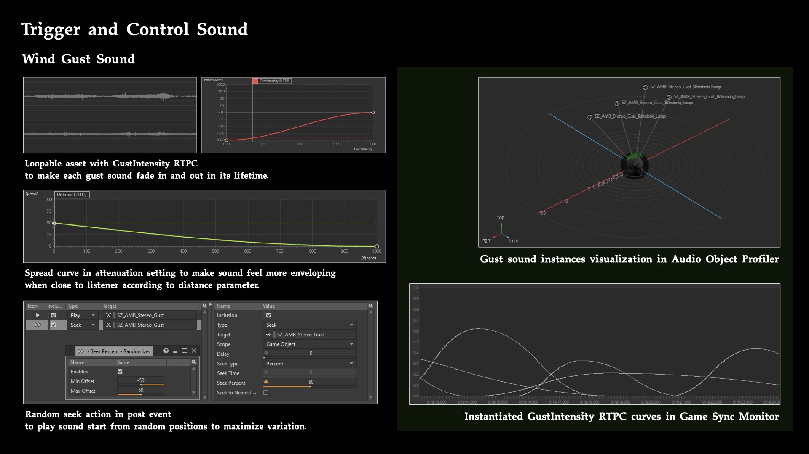
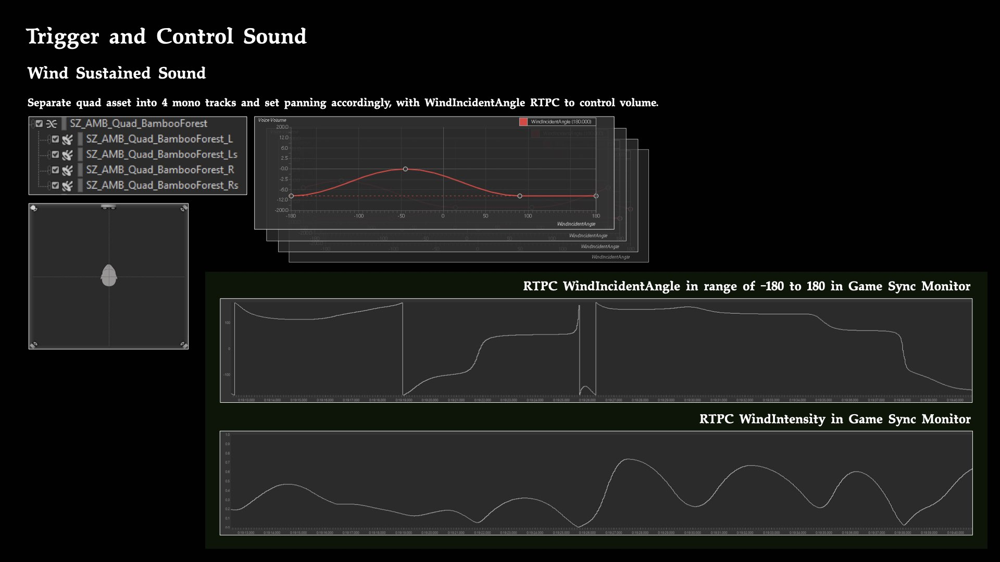

# 基于听者的动态风声设计

***
<!-- Start Document Outline -->

* [Wind Blowing over Head](#wind-blowing-over-head)
* [Deconstruct and Remodel Wind](#deconstruct-and-remodel-wind)
	* [Calculate Wind Gust Direction](#calculate-wind-gust-direction)
	* [Calculate Wind Gust Intensity](#calculate-wind-gust-intensity)
	* [Calculate Wind Gust Path](#calculate-wind-gust-path)
	* [Calculate Wind Gust Interval](#calculate-wind-gust-interval)
	* [Get Final Parameters](#get-final-parameters)
* [Trigger and Control Sound](#trigger-and-control-sound)
	* [Wind Gust Sound](#wind-gust-sound)
	* [Wind Sustained Sound](#wind-sustained-sound)
* [Summary](#summary)

<!-- End Document Outline -->
***

## Wind Blowing over Head

想象一下自己身处在一片竹林之中，徐徐微风穿梭在数米高的竹林之间，头顶上茂密的竹叶随风而动，在各个方位发出持续的窸窣声，偶尔一阵强风从后方吹来，竹叶的窸窣声由远及近拂过头顶，又从前方吹远淡去。这一小段场景所描述的听觉体验主要有两个重点，一是由竹林风声环绕四周带来的包围感，二是由间歇性的强风吹过头顶引起的方向感。本文将以实现上述听觉体验为目标，提供一种在传统环境声设计基础上进行改进的实现方案。

首先从文章标题中的几个概念入手，明确一下设计框架和限定条件：
1. 现实生活中所说的风声通常并不是风自身发出的声音，而是空间中的物体受空气流动影响而发出的声音。而游戏中的环境声设计，特别是在自然环境场景中，所谓风声其实是各类植被受风驱动而发出的声音，构成了环境声部分的基础层次，具体的声音素材制作也是围绕植被种类而展开的。
1. 单纯地制作一个听起来由远及近且有方向性的风声素材是相对容易的，通过调整声像来改变各个声道输出的信号量就可以进行大致的模拟，但是游戏中的风向和风速等参数都是可以实时且连续变化的，有限的素材数量难以满足所有复杂情况，因此本方案强调的动态设计是指，风声会以一种更偏程序性生成的方式根据风的实时参数而变化，同时游戏中的其他系统也可以利用这些数据配合声音来一起实现更全面的效果。
1. 如果从拟真的角度去设计一个实时风系统，需要引入流体力学方面的知识，Jos Stam 写于2003年的论文[《Real-Time Fluid Dynamics for Games》](https://www.dgp.toronto.edu/public_user/stam/reality/Research/pdf/GDC03.pdf)对此给出了详细的实现方案，Rupert Renard 在2019年 GDC 演讲[《Wind Simulation in God of War》](https://www.youtube.com/watch?v=dDgyBKkSf7A)也以实际游戏项目为例进行了分享，感兴趣的朋友可以自行查阅。而本文方案不会涉及任何有关流体力学的内容，主要是从声音效果的角度出发将影响风声的一些参数进行抽象和重构，以听者为中心（Listener-Centered）来设计一个简单的风系统。

```
开发环境与工具：
Unreal Engine 4.26
Audiokinetic Wwise 2021.1.4
```

## Deconstruct and Remodel Wind



从听者的角度来看，风的两个属性与实际感受最为相关：一是 Wind Direction，风的方向；二是 Wind Intensity，风的强度。持续的风可以看作是由一阵阵风 [Gust](https://en.wikipedia.org/wiki/Wind_gust) 此起彼伏地不断组合而成，每一个 Gust 都有着各自的 Direction，以及在各自的周期内随时间变化的 Intensity。因此，我们可以设计一个能够持续不断地产生 Gust 的系统，其中每一个 Gust 可以看作是一个长度随时间变化的向量，向量的参数由初始输入决定，所有 Gust Vector 向量之和就是当下整体风的向量 Wind Vector，接下来的具体过程也正是围绕如何计算这些向量来展开的。

### Calculate Wind Gust Direction


一般来说风在水平方向上的运动比较直观可感，同时也是为了简化计算，暂且忽略风向在垂直方向 Z 轴上的变化，因此在计算风向时只需计算在 XY 平面上的角度变化就可以了。如上俯视图所示，规定世界坐标系内 X 正轴方向(1, 0)作为参考方向，起始为0度，顺时针方向展开一圈为360度，目标风向角度 TargetAngle 由输入参数 AngleBase 结合 AngleBaseOffset 在一定范围内随机而得到，这样就可以在单位圆上通过三角函数来求得 Gust 的单位向量了。  

### Calculate Wind Gust Intensity


借用声音工作者应该都了解的 ADSR 概念，Gust 从起始到结束的整个周期 Lifetime 中，强度变化的曲线包络可以分成两个阶段，强度从0变化到最大目标强度 TargetIntensity 的阶段称为 Attack，又从 TargetIntensity 变化到0的阶段称为 Release。TargetIntensity、AttackTime 和 ReleaseTime 这三个数值由输入参数得到，可以根据需要表征出各种不同类型 Gust 的强度曲线包络。  
下列代码通过变量 Timer 作为计时器配合 `FMath::InterpEaseInOut()` 函数来计算 Gust Vector 在 Lifetime 内的变化，改变输入的数值参数就可以快速获得类型各异且带有范围随机的结果。

```
void FWindGust::GustInit()
{
    float IntensityTarget = FMath::RandRange(IntensityMin, IntensityMax);
    float DirAngleTarget = FMath::RandRange(AngleBase - AngleBaseOffset, AngleBase + AngleBaseOffset);
    float RadianTarget = FMath::DegreesToRadians(DirAngleTarget);
    
    VectorTarget = FVector2D(FMath::Cos(RadianTarget), FMath::Sin(RadianTarget)) * IntensityTarget;
    
    AttackTimeTarget = FMath::RandRange(AttackTime - AttackTimeOffset, AttackTime + AttackTimeOffset);
    ReleaseTimeTarget = FMath::RandRange(ReleaseTime - ReleaseTimeOffset, ReleaseTime + ReleaseTimeOffset);
    
    Lifetime = AttackTimeTarget + ReleaseTimeTarget;
    Timer = 0.f;
}
```

```
void FWindGust::GustTick(float DeltaTime)
{
    Timer += DeltaTime;
    
    // Attack...
    if (Timer < AttackTimeTarget)
    {
        GustVector = FMath::InterpEaseInOut<FVector2D>(FVector2D::ZeroVector, VectorTarget, Timer / AttackTimeTarget, InterpExp);
    }
    // Release...
    else if (Timer >= AttackTimeTarget && Timer < Lifetime)
    {
        GustVector = FMath::InterpEaseInOut<FVector2D>(VectorTarget, FVector2D::ZeroVector, (Timer - AttackTimeTarget) / ReleaseTimeTarget, InterpExp);
    }
}
```

### Calculate Wind Gust Path


获得上述风的方向和强度之后，就相当于完成了对 Gust Vector 的运算，接下来计算 Gust 的移动路径就非常直接了。Gust 将从以听者位置为圆心、以 Distance 为半径的圆周上的一端开始移动，穿过圆心并结束于另一端。同时，HeightOffset 参数可以控制整条路径在高度上相对于听者的变化，比如表现草地可以设置在听者位置之下，表现树叶则可以设置在听者位置之上。

### Calculate Wind Gust Interval



根据环境类型的需求，在生成 Gust 的系统中可以设置多套不同的 Gust 参数，比如有些短小急促有些缓慢绵长，它们按照各自设定的触发间隔来持续地生成实例化的 Gust。

### Get Final Parameters

每生成一个 Gust 都将其存入一个统计数组参与后续计算，对所有已生成的 Gust Vector 进行相加，就可以得到当前整个风系统的 Wind Vector。

```
// Tick gust...
FVector2D GustVectorSum = FVector2D::ZeroVector;

for (int i = 0; i < GustSumArray.Num(); i++)
{
    GustSumArray[i].GustTick(DeltaTime, PlayerCamera->GetCameraLocation());
    GustVectorSum += GustSumArray[i].GustVector;
}

// FIN WindVector...
WindVector = GustVectorSum;
```

风的强度 Wind Intensity 即 Wind Vector 的长度：

```
// FIN WindIntensity...
WindIntensity = WindVector.Size();
```

风的方向 Wind Direction Angle 可以以 Wind Vector 与参考方向(1, 0)之间形成的夹角来表示。  
下列代码参考自视频 [Get The Angle Between 2D Vectors](https://www.youtube.com/watch?v=_VuZZ9_58Wg)，通过点乘和叉乘相关的运算并配合叉乘的正负性判断，可以快速地求出两向量之间的夹角，并映射成一定范围内的数值。

```
// FIN WindDirectionAngle...
float DirAglCrossProd = WindVector.X * ReferDirVector.Y - WindVector.Y * ReferDirVector.X;
float DirAglDotProd = WindVector.X * ReferDirVector.X + WindVector.Y * ReferDirVector.Y;

WindDirectionAngle = FMath::RadiansToDegrees(FMath::Atan2(FMath::Abs(DirAglCrossProd), DirAglDotProd));
if (DirAglCrossProd > 0)
{
    WindDirectionAngle = 360 - WindDirectionAngle;
}
```

为了后续能更直观地基于听者来使用风向参数，可以进一步计算 Wind Vector 与镜头朝向之间的关系，即求出风向相对于听者的入射角度 Wind Incident Angle，并规定听者左半边为-180至0度，右半边为0至180度。

```
// FIN WindIncidentAngle...
FVector CameraFwdVector = PlayerCamera->GetActorForwardVector();
FVector2D CameraDirVector = FVector2D(CameraFwdVector.X, CameraFwdVector.Y);

float IncAglCrossProd = WindVector.X * CameraDirVector.Y - WindVector.Y * CameraDirVector.X;
float IncAglDotProd = WindVector.X * CameraDirVector.X + WindVector.Y * CameraDirVector.Y;

WindIncidentAngle = 180 - FMath::RadiansToDegrees(FMath::Atan2(FMath::Abs(IncAglCrossProd), IncAglDotProd));
if (IncAglCrossProd < 0)
{
    WindIncidentAngle = -WindIncidentAngle;
}
```

## Trigger and Control Sound

完成上述整个风系统的设计与运算之后，就到了触发声音和使用相应参数进行控制的环节了。

### Wind Gust Sound

每当生成一个 Gust 实例时，同时创建一个对应的 `UAkComponent` 并开始播放声音；Gust 的位置更新和 Intensity RTPC 需要设置在对应的 `UAkComponent` 上，以此保证同时存在的多个 Gust 之间时相互独立的。

```
void FWindGust::GustInit(UDirectionalWindComponent* Outer)
{
    // Showed above in chapter of Calculate Wind Gust Intensity...

    if (AkSound)
    {
        AkComp = NewObject<UAkComponent>(Outer);
        AkComp->RegisterComponent();
        AkComp->PostAkEvent(AkSound, {}, {}, {}, {});
    }
}
```

```
void FWindGust::GustTick(float DeltaTime, FVector ListenerLocation)
{
    // Showed above in chapter of Calculate Wind Gust Intensity...
    
    float DistanceToListener;
    // Attack...
    if (Timer < AttackTimeTarget)
    {
        DistanceToListener = FMath::InterpEaseInOut<float>(-1, 0, Timer / AttackTimeTarget, InterpExp);
    }
    // Release...
    else if (Timer >= AttackTimeTarget && Timer < Lifetime)
    {
        DistanceToListener = FMath::InterpEaseInOut<float>(0, 1, (Timer - AttackTimeTarget) / ReleaseTimeTarget, InterpExp);
    }
    
    if (AkComp)
    {
        float RltLocMultipiler = DistanceToListener * Distance;
        FVector RltLocation = FVector(VectorTarget.X * RltLocMultipiler, VectorTarget.Y * RltLocMultipiler, HeightOffset);
        FVector WldLocation = ListenerLocation + RltLocation;
        AkComp->SetWorldLocation(WldLocation);
        AkComp->SetRTPCValue(IntensityRTPC, GustVector.Size(), {}, {});
    }
}
```



由于 Gust 时长由输入参数决定且可以在很大范围内随机变化，制作固定长度的声音素材很难与其匹配，因此可以直接制作一段可循环的声音素材，并用 GustIntensity RTPC 控制其响度依据强度包络曲线进行淡入淡出；在 Attenuation 设置中添加 Spread Curve，让声音的包围感依据距离产生变化。另外还有一个值得一提的小技巧是，在 PostEvent 中添加一个随机位置的 Seek Action，这样每次播放都会从音频文件的不同位置开始，让声音产生更多变化。  
如上图所示，在 Audio Object Profiler 界面中可以观察各个 Gust 基于听者的移动路径，在 Game Sync Monitor 中可以观察各个 Gust 各自的 GustIntensity RTPC 曲线变化。

### Wind Sustained Sound

除了 Gust Sound 作为3D声源提供方向感之外，额外播放一层基于声道的环绕声素材 Sustained Sound 作为持续的风声铺底，营造包围感的同时还可以配合入射角度进一步加强方向感。



将四声道素材拆分成四条单声道素材，设置到相对应的 L、R、Ls、Rs 声像位置上，并用 WindIncidentAngle RTPC 来调整其响度变化，这样的话与入射角一致的方向上的声音会比其他方向略微响一些。同时，WindIntensity RTPC 也可以用于控制这个环绕声素材的整体响度变化。  
如上图所示，在 Game Sync Monitor 中可以观察 WindIncidentAngle 和 WindIntensity 的 RTPC 曲线变化。

## Summary

最终效果见[视频演示](https://youtu.be/JDGloa1YwY0)。  
视频中红色箭头表示 Wind Vector，竹叶特效由风系统驱动，右侧为 Wwise 中 RTPC 和 Audio Object 的实时状态。

这个设计的最初起因是，想着如何用简单的方式在游戏中动态地实现风吹而过的体验，一开始尝试的是在环绕声素材上控制响度和高低通变化，测试发现仅对素材进行调整的方式达不到效果。期间发现了文章开头提到的用流体力学实现风系统的方案，大致浏览了一下论文之后就放弃了，我对自己的数学功底和代码水平还是有自知之明的，而且对从声音表现出发考虑的需求来说，完全用不上这么重型且底层的设计。几经修改，最终确定了现在这种基于听者、围绕向量展开计算、3D移动声源结合2D声源的方案。

这个方案在运算上确实是实现了风声穿过听者位置的要求，但就目前的演示效果来看，离现实世界中那种风吹而过的体验还是有差距的。风吹而过，不单单只是声源位移响度变化那么简单，其中的细节其实是由风与人耳和身体等部分交互而产生的，这些体验还很难通过有限的分层素材和参数控制完全还原出来。再往下说就要扯到 Binauralization 相关的话题了……


希辰  
2021.12.3

***