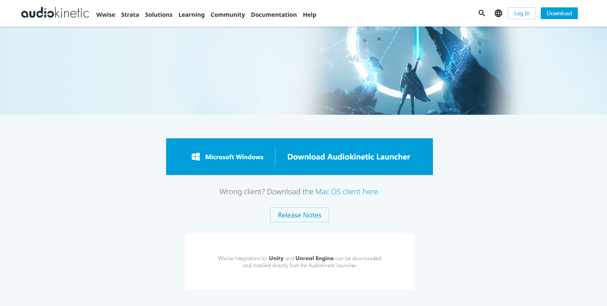
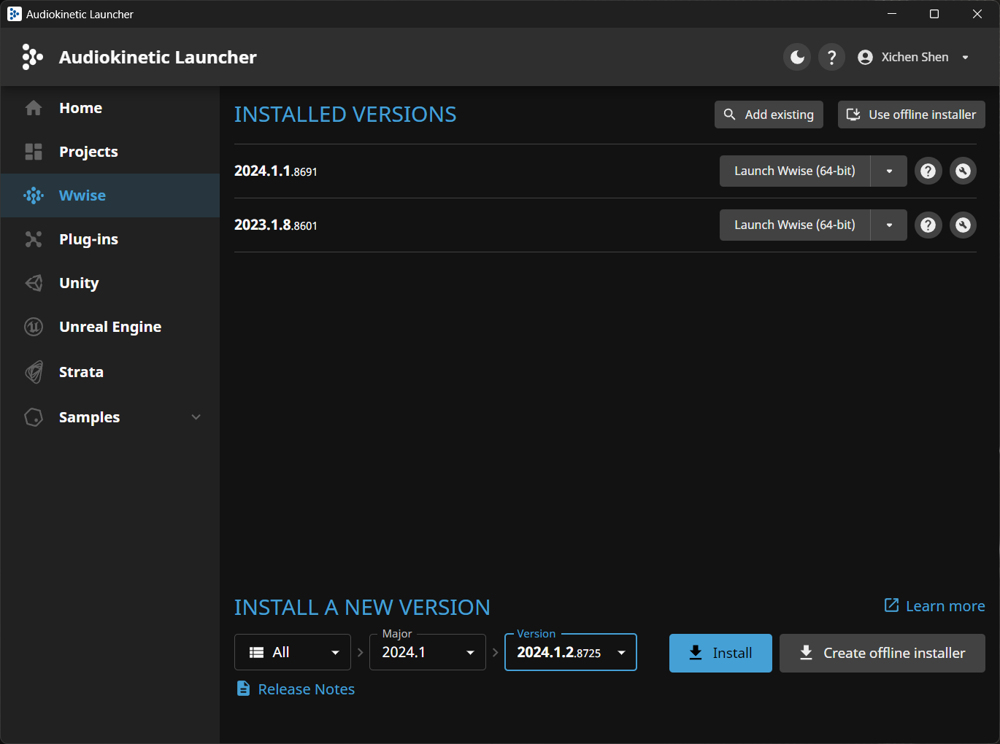
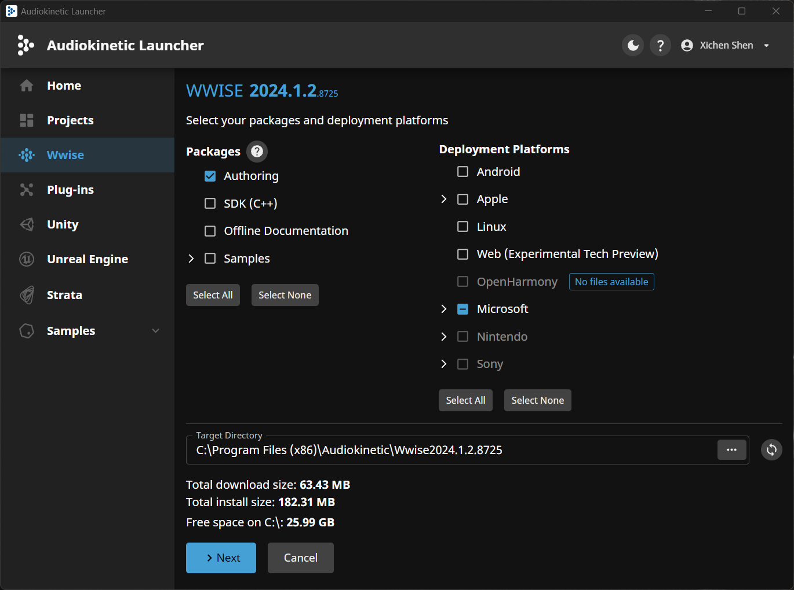
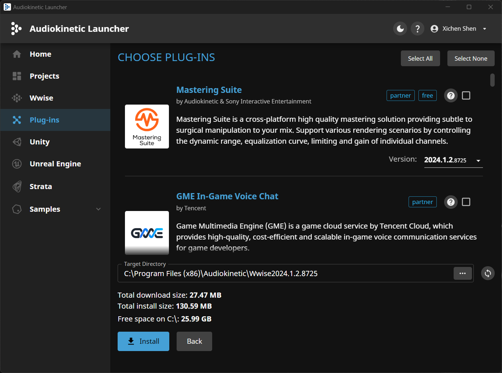
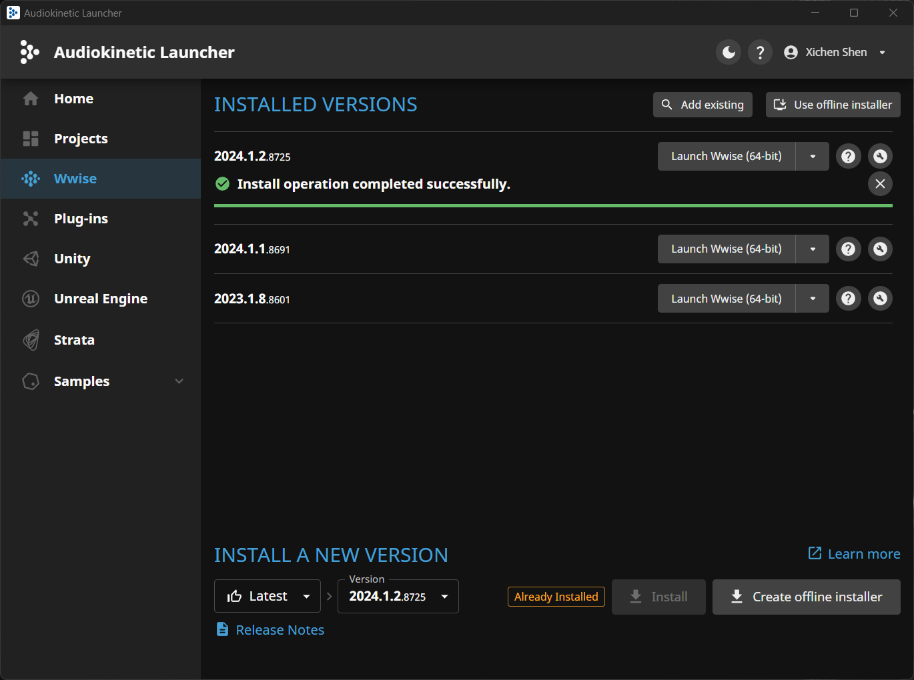

# 游戏音频中间件

:::info
本课程目前使用 Audiokinetic Wwise 2024 版本为例  
2024 版本与之前的版本在 UI 界面上有较大的改动  
Updated at 2025.2
:::

## Wwise

### 下载安装

- 前往[官网](https://www.audiokinetic.com/en/download/)下载 Launcher 并安装

- 打开 Audiokinetic Launcher，注册账号并登录，选择版本号，点击 Install

- Packages 中选择 Authoring（就是指 Wwise），Deployment Platforms 中选择 Microsoft，其他自行按需选择

- 考虑到部分插件需要 License，简化起见，初次安装可以不勾选任何插件，等之后需要时再添加

- 安装完成
