# 游戏引擎与游戏音频中间件的整合

:::info
本课程目前使用 Unreal Engine 5 和 Audiokinetic Wwise 2024 版本为例  
Updated at 2025.3
:::

## Wwise Unreal Integration

### Integrate Wwise with AK Launcher

- 打开 AK Launcher，在 Wwise 页签中找到已安装的 Wwise 版本  
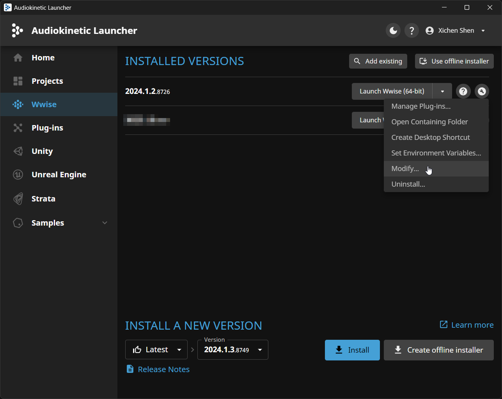
- 新增勾选 SDK (C++)，点击下一步，完成更新  
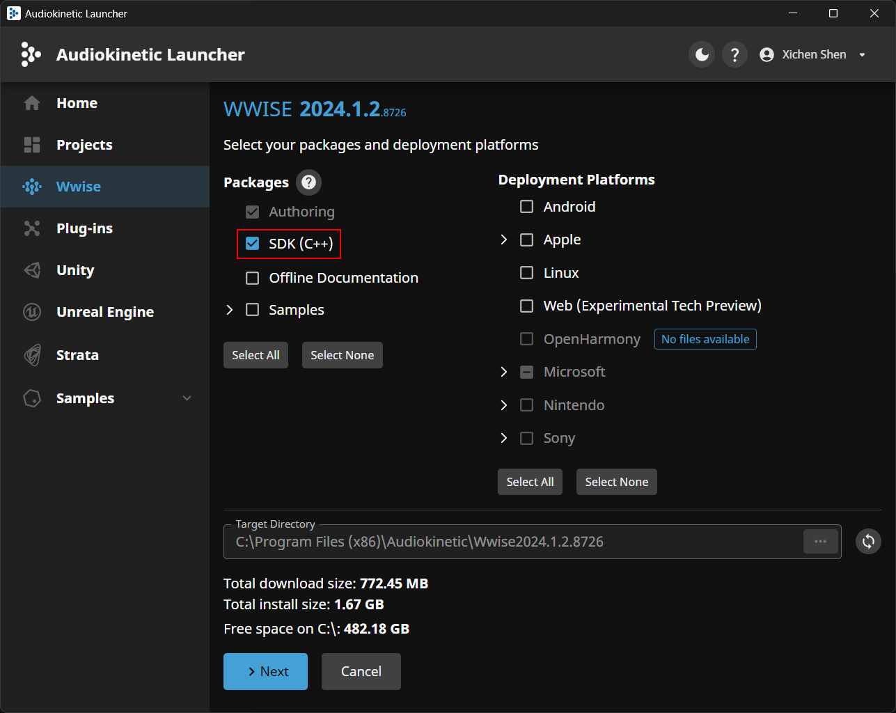
- 在 Unreal Engine 页签中找到已创建的 UE 工程，点击 Integrate Wwise  
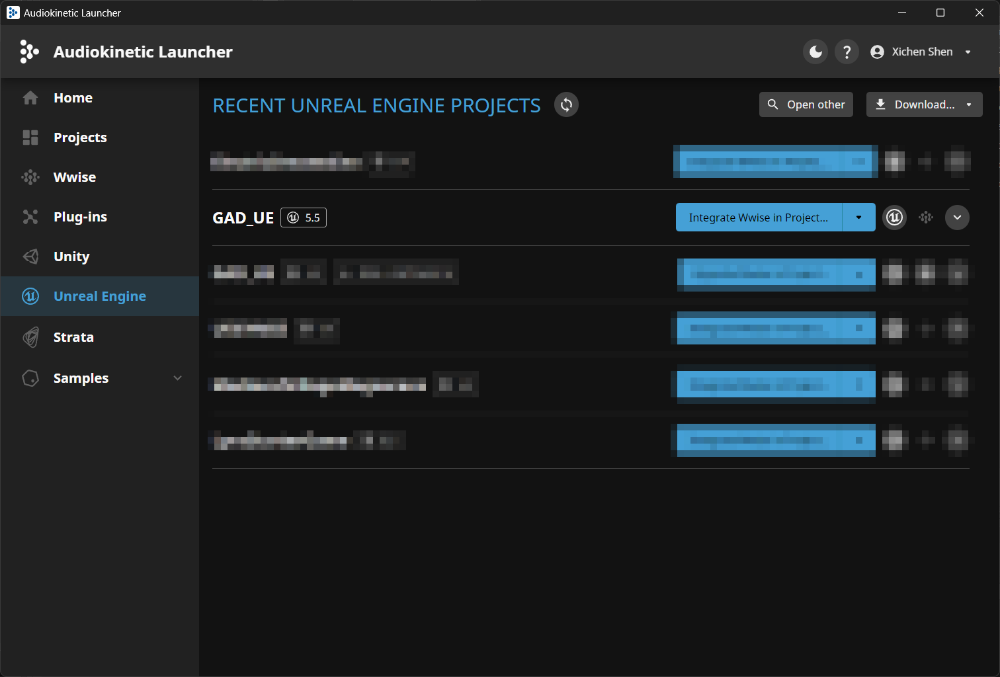
- 正确选择已安装且更新 SDK 的 Wwise 版本  
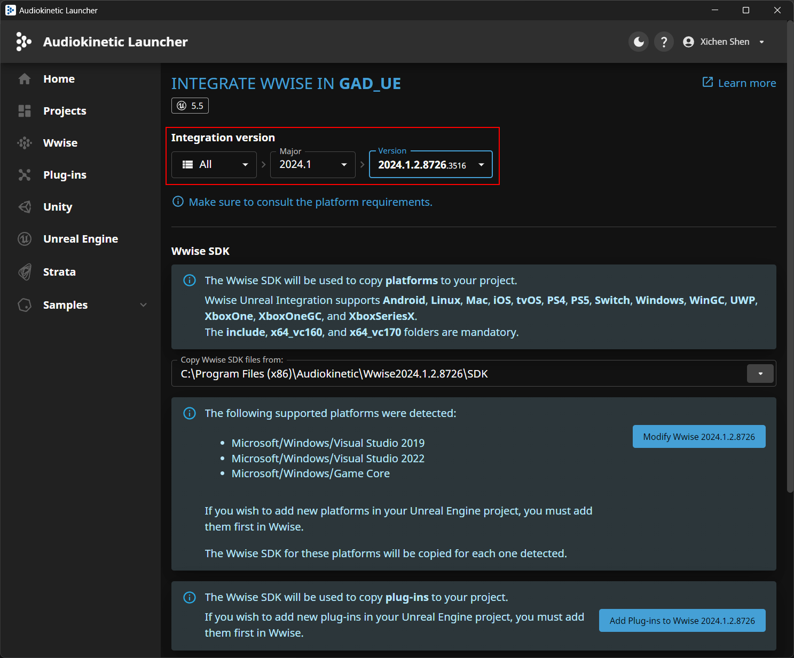
- 正确选择已创建的 Wwise 工程，点击 Integrate  
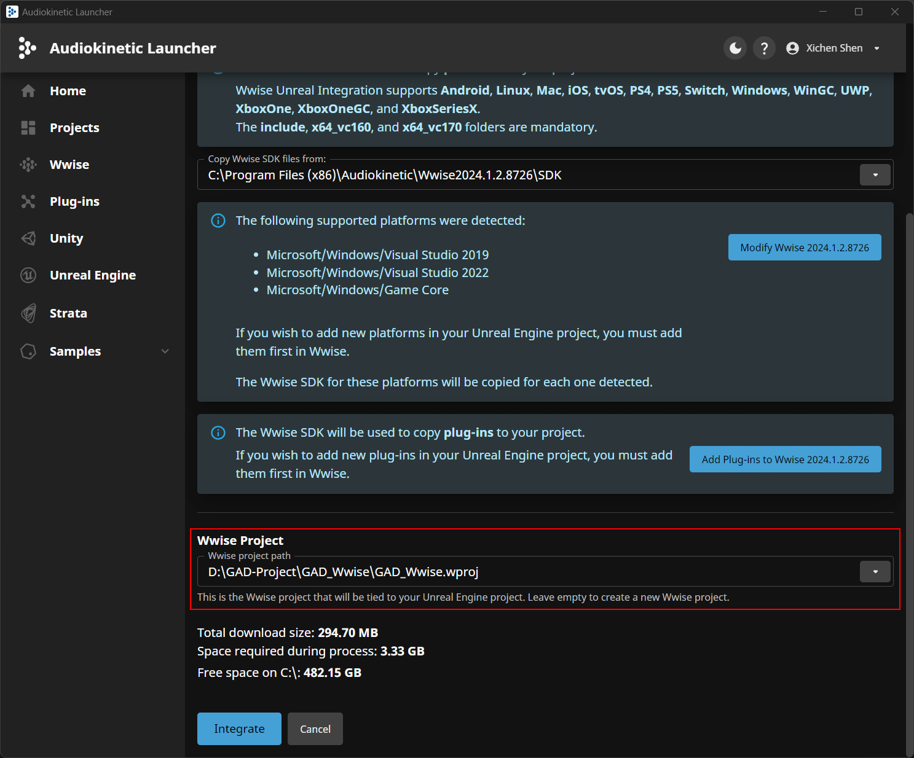
- 至此已完成使用 AK 官方的工具来实现 Wwise 和 UE 的整合  
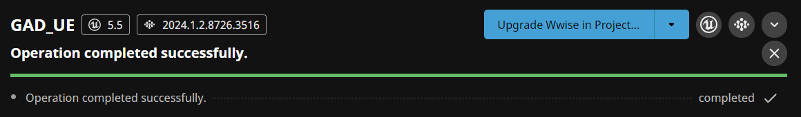

### Wwise Project Settings

- 打开 Wwise 工程中的 Project Settings 选项  
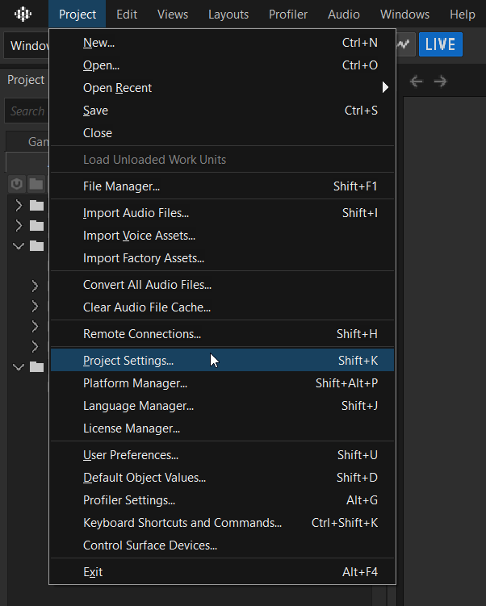
- 在 SoundBanks 页签中，勾选 Enable Auto-Defined-SoundBanks 选项  

- 切换至 SoundBank 视图  
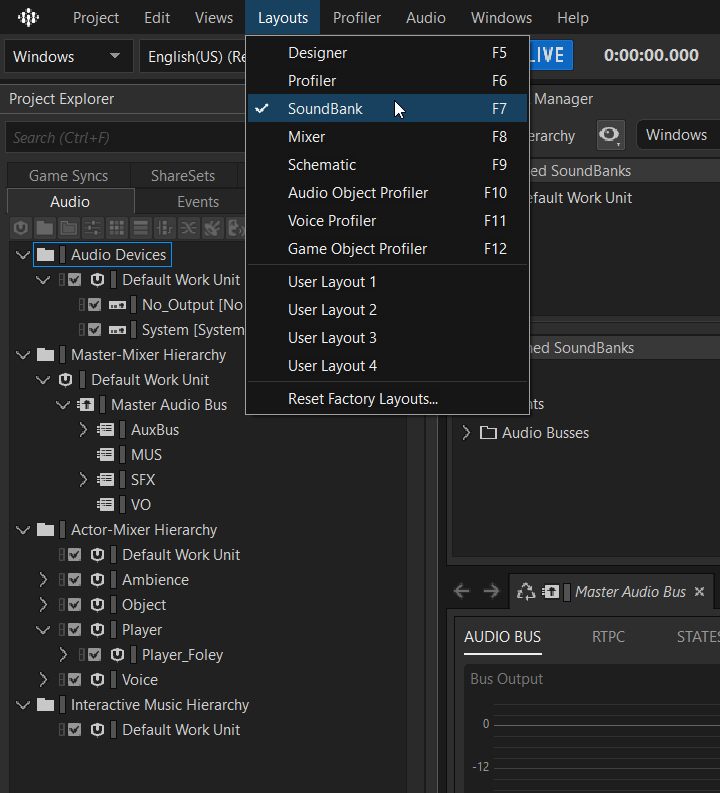
- 点击右上角 Generate All，首次生成 SoundBanks  
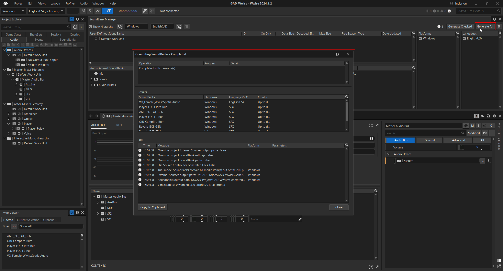

### UE Project Settings
- 打开 UE 工程中的 Project Settings 选项  
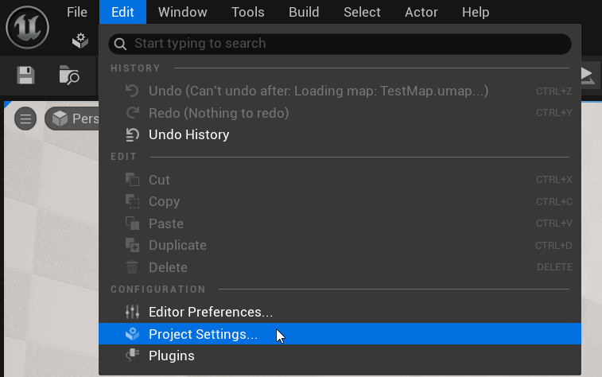
- 在 Wwise Integration Settings 页签中，填写正确的 Wwise 工程路径和 Output 输出路径  
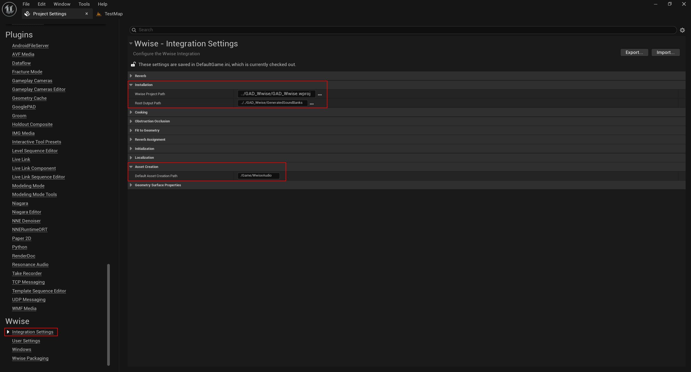
- 在 Wwise User Settings 页签中，填写正确的 Wwise 安装路径和 WAAPI 设置  
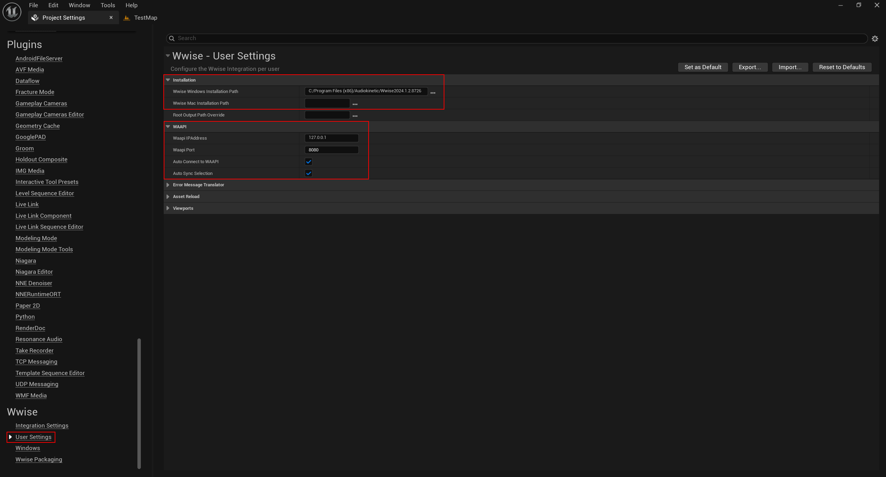

### UE Wwise Browser
- 打开 UE 工程中的 Wwise Browser 界面  
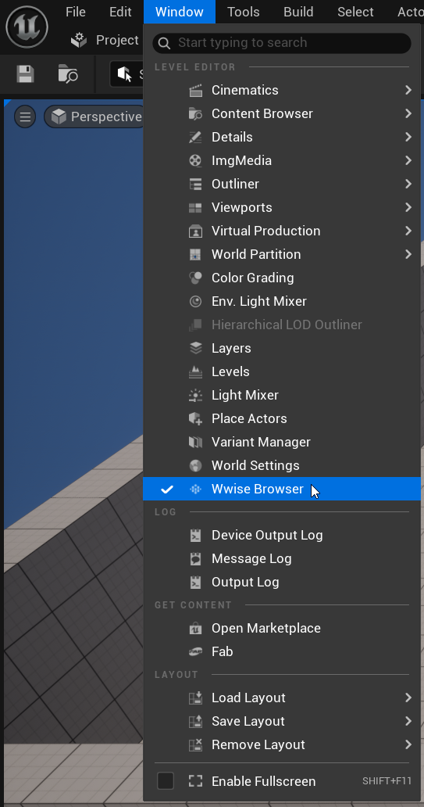
- 显示如下界面，说明整合工作已完成  
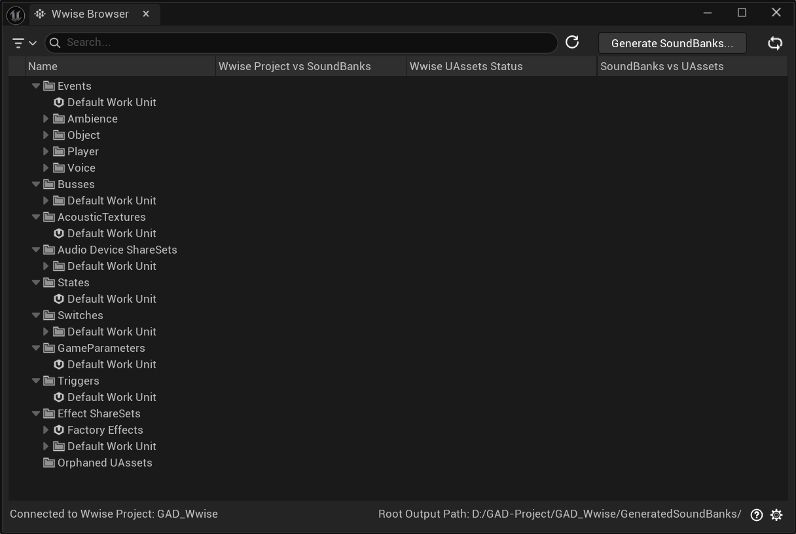

More：[Wwise Unreal Integration](https://www.audiokinetic.com/en/library/edge/?source=UE4&id=index.html)

---