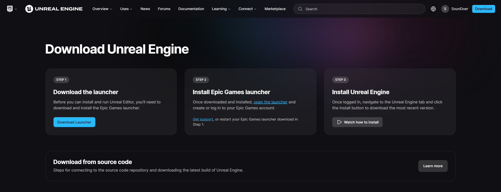
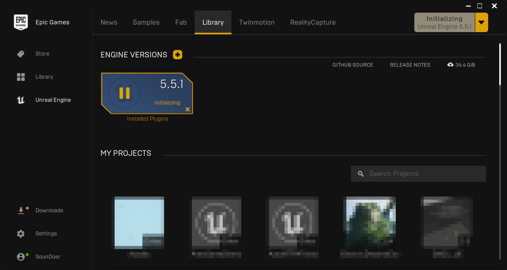
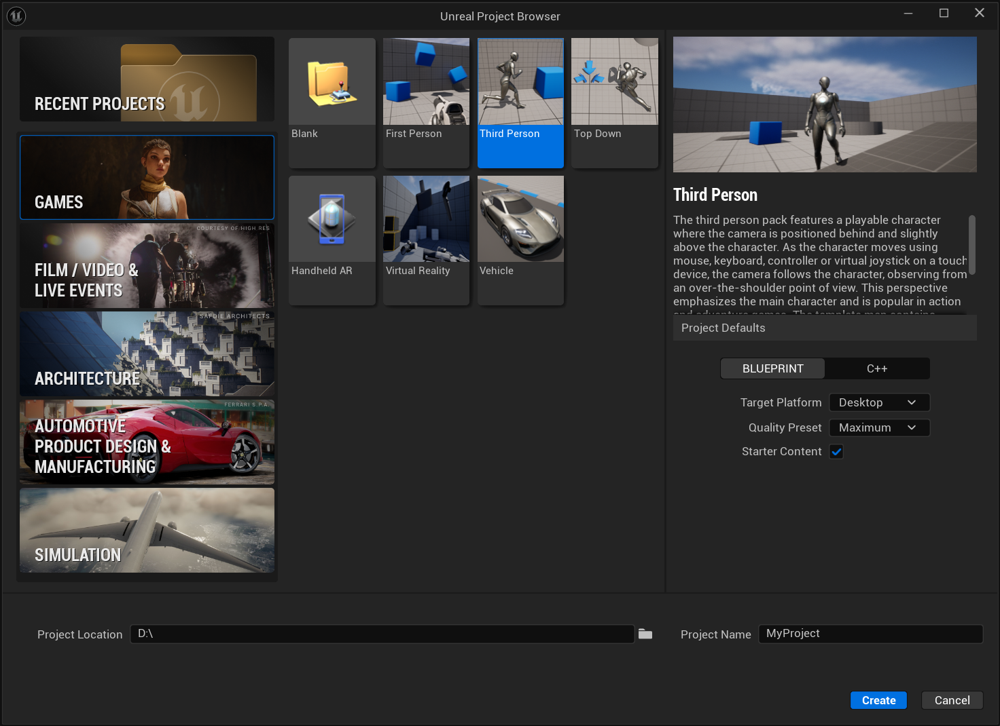
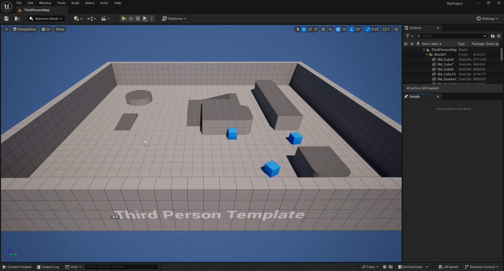

# Game Engine

:::info
本课程目前使用 Windows 平台 Unreal Engine 5 版本为例  
Updated at 2025.2
:::

## Unreal Engine

### 下载安装

- 前往[官网](https://www.unrealengine.com/en-US/download)下载 Launcher 并安装

- 打开 Epic Games Launcher，注册账号并登录，安装 Unreal Engine

- 更多细节可参考官方文档 [Installing Unreal Engine](https://dev.epicgames.com/documentation/en-us/unreal-engine/installing-unreal-engine)

### 创建工程

- 在 Games 页签下选择创建一个 Third Person 模板工程

- 参考官方文档 [Unreal Editor Interface](https://dev.epicgames.com/documentation/en-us/unreal-engine/unreal-editor-interface) 熟悉界面布局

### 更多

[官方文档](https://dev.epicgames.com/documentation/en-us/unreal-engine)

## Unity

……待更新……

---