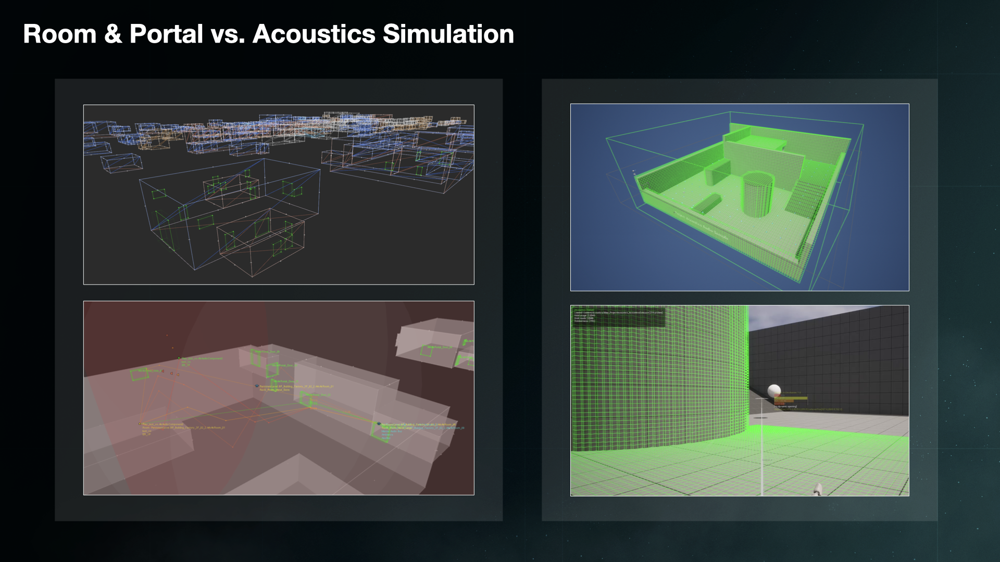
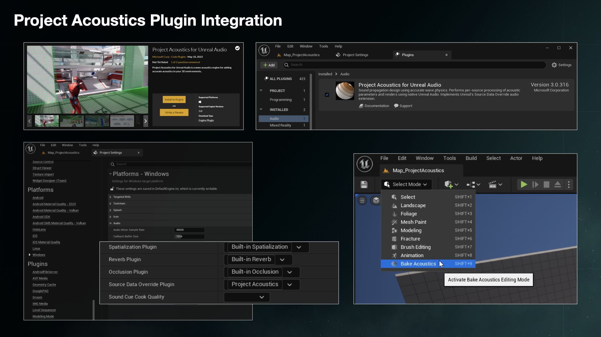
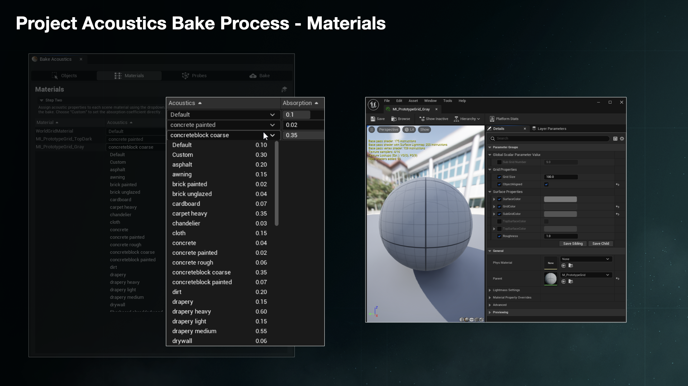
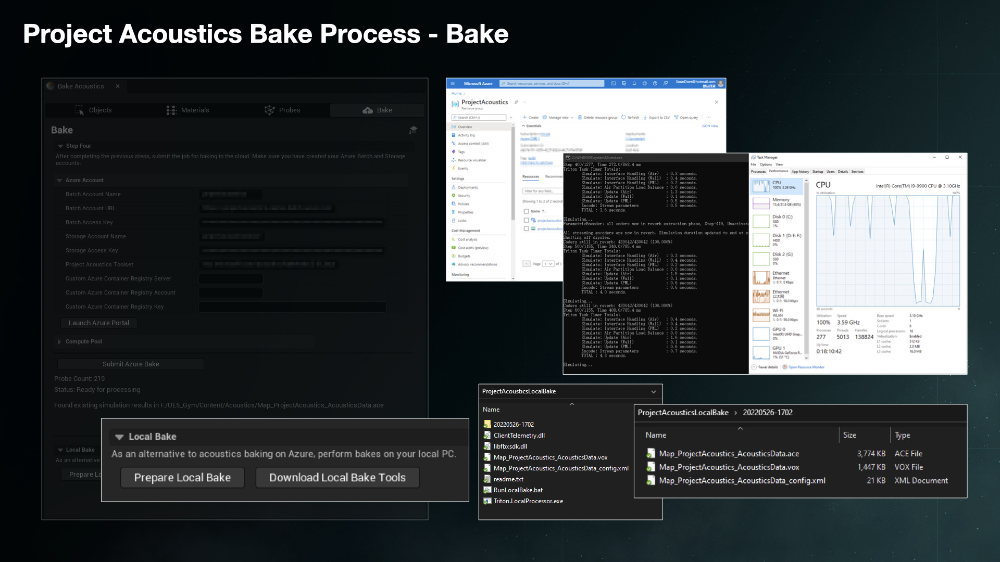
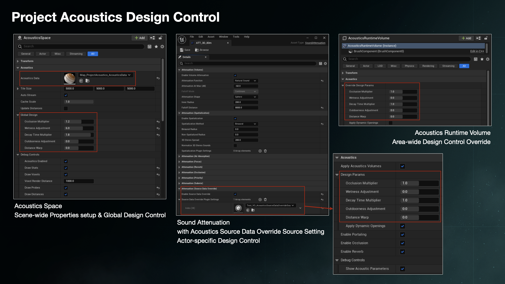
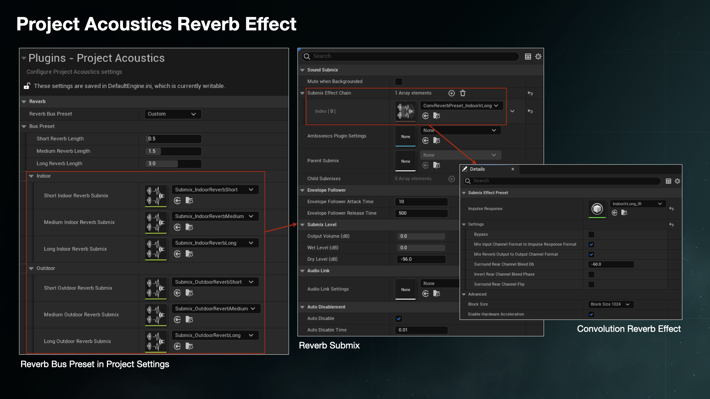
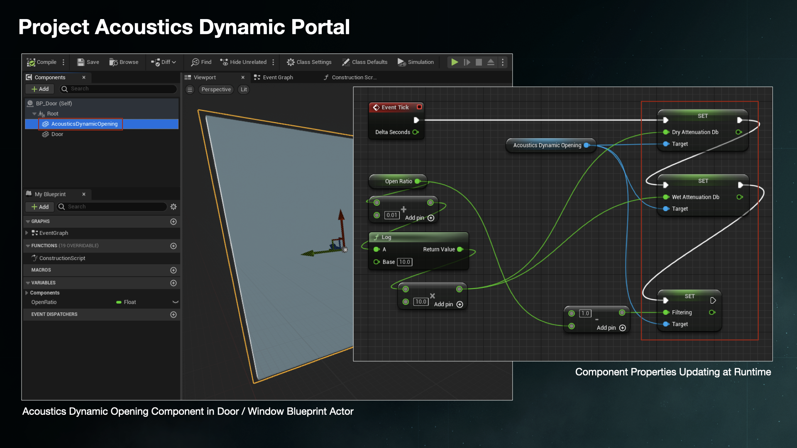

# Microsoft Project Acoustics 声波物理模拟测试

***
<!-- Start Document Outline -->

* [What is Project Acoustics](#what-is-project-acoustics)
* [Workflow](#workflow)
	* [Plugin Integration](#plugin-integration)
	* [Bake Process](#bake-process)
	* [Design Control](#design-control)
		* [Reverb Effect](#reverb-effect)
		* [Dynamic Portal](#dynamic-portal)
* [Playtest Conclusion](#playtest-conclusion)

<!-- End Document Outline -->
***

[Project Acoustics](https://docs.microsoft.com/en-us/gaming/acoustics/what-is-acoustics) 是 Microsoft 的一个声学效果实现方案，用于在游戏等 3D 交互项目中实现 Occlusion、Obstruction 和 Reverb 等效果。该方案最早源自研究项目 [Project Triton](https://www.microsoft.com/en-us/research/project/project-triton/)，发展至今已有十多年，也已在一些游戏项目中经过验证。之前在[《展望游戏音频设计的发展方向》](What-will-The-Next-Gen-of-Game-Audio-Design-be-like.md)文中的“声学环境建模”章节中做过简单介绍，最近[该方案](https://www.unrealengine.com/marketplace/en-US/product/project-acoustics-for-unreal-audio)以 Engine Plugin 的形式发布至 UE 商城，正式支持 UE5 版本，整合流程和设计功能与之前相比也有了较大的改进，趁此时机正好对 Project Acoustics 做一个全面深入的测评。

## What is Project Acoustics



目前 3D 环境声学效果实现的各种方案大多都是建立在界定 Room 和 Portal 并进行 Raytracing 的思路之上，而 Project Acoustics 则采用了一种完成不同的方式，类似于光照烘焙（Static Light Baking），将复杂环境中声波传播的真实效果进行离线运算并存储下来，并从中提取重要参数用于设计控制和实时运算。

> Project Acoustics' philosophy is similar to static lighting: bake detailed physics offline to provide a physical baseline, and use a lightweight runtime with expressive design controls to meet your artistic goals for the acoustics of your virtual world.

这种方案避免了音频设计师依据美术场景手动界定 Room 和 Portal 的工作量，降低了 Raytracing 的实时运算消耗，而且离线模拟计算不需要对场景进行简化处理，由此生成的数据在一些复杂几何环境中的声学效果会更为精准可控。在获得了离线模拟数据的基础上，音频设计师可以更多关注在对音频参数的实时控制上来获得预想的效果。

> Project Acoustics' simulation captures these effects using a wave-based simulation. The acoustics are more predictable, accurate and seamless.  
> Project Acoustics' key innovation is to couple real sound wave based acoustic simulation with traditional sound design concepts. It translates simulation results into traditional audio DSP parameters for occlusion, portaling and reverb. The designer uses controls over this translation process.

需要说明的是，Project Acoustics 并不是取代了目前已有的工具或方案，而是可以看作整个音频空间化（Audio Spatialization）流程中对 3D 环境声学建模环节的另一种实现方式。Project Acoustics 本身并不是独立完成定位和混响等声音效果的实现，而是对离线模拟数据中的信息进行处理，然后交给引擎或者音频中间件内的相应模块来实现最终效果，以更具适应性和扩展性的方式嵌入到现有的工作流中去。

## Workflow

目前官方提供了针对 Unreal、Unity 引擎和 Wwise 音频中间件的整合方案，并提供了相应的示例工程，大家可以前往项目官网下载测试。下文将以 Unreal Audio 整合方案和自制地图关卡为例，测试整体使用流程和功能效果。

```
Unreal Engine 5.0.1
Project Acoustics for Unreal Audio 3.0.316
```

### Plugin Integration

从 UE 商城下载并安装 Project Acoustics for Unreal Audio 插件，创建 C++ 项目工程并完成编译。在编辑器 Plugins 管理界面中启用该插件，在编辑器 Project Settings 界面的 Platforms - Windows 中，将 Source Data Override Plugin 设置成 Project Acoustics。Spatialization、Reverb 和 Occlusion Plugin 可使用 Build-in 或者其他可选设置，然后就可以在 Select Mode 中选择 Bake Acoustics 了。更多插件安装信息可参考官方文档 [Project Acoustics Unreal Audio Plugin Integration](https://docs.microsoft.com/en-us/gaming/acoustics/unreal-audio-integration)。



### Bake Process

在 Select Mode 中的 Bake Acoustics 界面中完成以下四个步骤：

1. Objects  
批量选择并标记场景中需要参与声学模拟计算的对象，支持 Static Mesh、Navigation Mesh 和 Landscape 类型。只有类型正确的被标记对象才会参与到后续的计算中。


2. Materials  
被标记对象使用到的所有 Materials 在此列出，根据需要选择材质吸声预设或者自定义数值，数值越大吸声效果越明显，混响效果也相应越少。预设中的数值参考自真实材料的吸声属性。


3. Probes  
选择模拟精度、数据命名前缀和输出路径，点击 Calculate 后将会显示当前场景所需要的 Probe 数量，并在输出路径中生成用于下一步 Bake 的 .vox 和 _config.xml 文件。每一个 Probe 代表了对该场景中听者可能所处位置的采样，因此 Probe 的数量直接影响下一步 Bake 所需要的时间，以及最终模拟效果的精度。如有需要可以显示高级参数，调整 Probe 的间隔距离和覆盖范围等参数，再次 Calculate 获得新的数据。


4. Bake  
目前有两种 Bake 方式可供选择：一是使用 Microsoft Azure 云服务，需要创建相应账户并完成服务器配置；二是下载相应工具，执行 Local Bake。  
本例使用 Local Bake 方式，测试关卡地图大小是 50m * 50m，Probe 数量为 219 个，CPU 型号 Intel Core i9-9900 3.10GHz，整个 Bake 过程耗时约 26 分钟，最终生成的 .ace 文件数据大小约为 3.68MB。


以上就是整个 Bake 过程，有关各个步骤中的具体操作和参数说明请参考官方文档 [Project Acoustics Unreal Bake Overview](https://docs.microsoft.com/en-us/gaming/acoustics/unreal-baking-overview)。  在上述自动化生成的基础上，工具还提供了一些用于进一步[手动调整的组件](https://docs.microsoft.com/en-us/gaming/acoustics/unreal-baking-advanced)。

### Design Control

将 Bake 生成的 .ace 文件导入至工程项目的指定路径 Content/Acoustics 下并创建相应的 .uasset，然后将其添加到在场景中放置的 Acoustics Space 对象中。在声源 Sound Attenuation 的 Source Data Override Plugin Settings 中创建并添加 Acoustics Source Data Override Source Settings 对象，这一对象包含了基于模拟数据提取的可控设计参数：  

- Occlusion Multiplier: Occlusion 效果调整
- Wetness Adjustment: 额外的混响效果响度值调整
- Decay Time Multiplier: 基于模拟数据的 RT60 值调整
- Outdoorness Adjustment: 室外/室内混响感的调整
- Distance Warp: 不影响直达声前提下对混响远近的调整

除了针对每个声源的设计控制之外，在场景内的 Acoustics Space 对象中也有一套相同的用于全局控制的设计参数，以及针对区域调整的 Acoustics Runtime Volume 对象中也有同样的设计参数。



更详细的操作和参数说明请参考官方文档 [Project Acoustics Unreal Audio Design Tutorial](https://docs.microsoft.com/en-us/gaming/acoustics/unreal-audio-design)。

#### Reverb Effect

混响效果的实现利用了 UE 原生的 Submix 和 Submix Effect 系统。编辑器 Project Settings 中的 Plugins - Project Acoustics 界面中显示了默认的 Reverb Bus 预设，可以使用自定义设置覆盖。混响系统有 Indoor 和 Outdoor 两个部分，各自包含了 Short、Medium 和 Long 三条 Submix，各个 Submix 中使用了不同 IR 的 Convolution Reverb 效果器。



#### Dynamic Portal

Project Acoustics 2.0 版本中加入了 [Dynamic Openings 功能](https://docs.microsoft.com/en-us/gaming/acoustics/unreal-beta)，用于实现门窗之类的动态 Portal，目前 3.0 版本中还处于 Beta 阶段。  
Bake 开始之前，在场景中的门窗对象中添加 Acoustics Dynamic Opening 组件，调整大小覆盖门窗尺寸，创建比率变量用于指示开合大小，并驱动 Acoustics Dynamic Opening 组件中的 Dry Attenuation、Wet Attenuation 和 Filtering 参数。Acoustics Dynamic Opening 组件所处位置在 Bake 过程中将会被标记；运行时，如果声源与听者之间的最短距离穿过该位置时，该组件就会响应门窗开合变化，并实时调整声源干湿声的响度。



## Playtest Conclusion

附上本例测试关卡的[视频演示](https://www.youtube.com/watch?v=lANptxJ49yI)，主要以距离衰减、障碍物掩蔽和动态门窗等效果的功能性测试为主，整体效果还是非常不错的。

Projec Acoustics 直接利用场景已有的几何结构和材质种类进行离线声学渲染的方式，大大减少了音频设计师根据美术场景再次搭建简化声学结构的工作量，同时对复杂几何环境也能有更精确的模拟。本例测试关卡场景比较简单，实际性能方面不太有说服力，仅仅以此做一个简单估算，地图尺寸极限放大一百倍之后的模拟数据文件大小约在几百 MB 级别，运行时也提供了 Auto Stream 的方式来控制内存消耗，这些指标在优化之后应该都能在可接受范围之内。与现有的 Room & Portal 方式相比，Project Acoustics 在设计控制方面的自由度肯定要小一些，主要还是侧重基于真实声学的模拟还原，因此更适合那些有 3D 场景的写实风格项目。另外，虽然 Bake 过程减少了人工搭建声学结构的工作量，但是 Bake 本身还是一个比较耗时的过程，特别是对于较大地图尺寸的项目来说，即使是有性能更快的云服务支持，在需要快速迭代验证的工作流程中可能还是有些繁琐。总的来说，Project Acoustics 开发至目前 3.0 版本，在各方面都已成熟可用，期待能在下一个项目中有更多的探索尝试。

最后，推荐观看 UE 官方的这一期 Inside Unreal 视频 [Microsoft Project Acoustics UE5 Marketplace Plugin](https://www.youtube.com/wtch?v=3uocCX0AMIg)，邀请了 Microsoft Project Acoustics 团队在线展示示例工程和讨论开发细节。

希辰  
2022.5.26

***