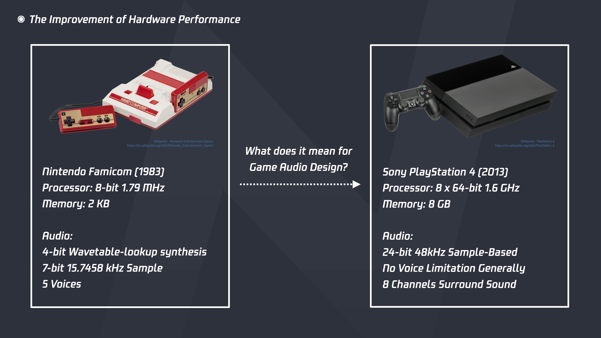
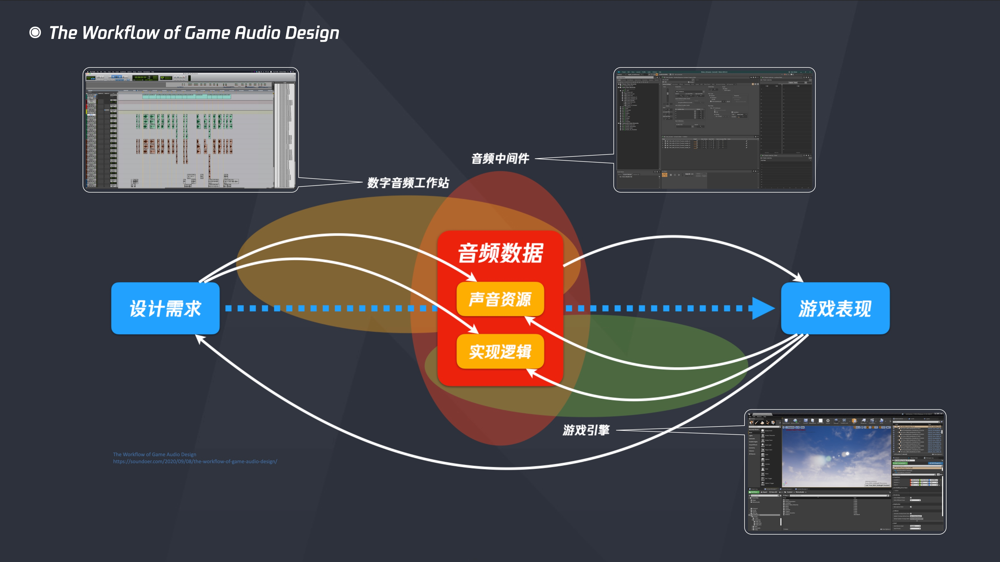
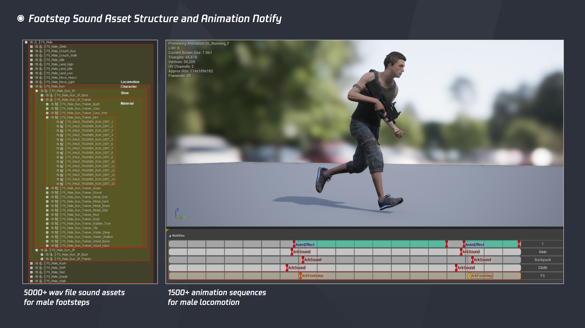
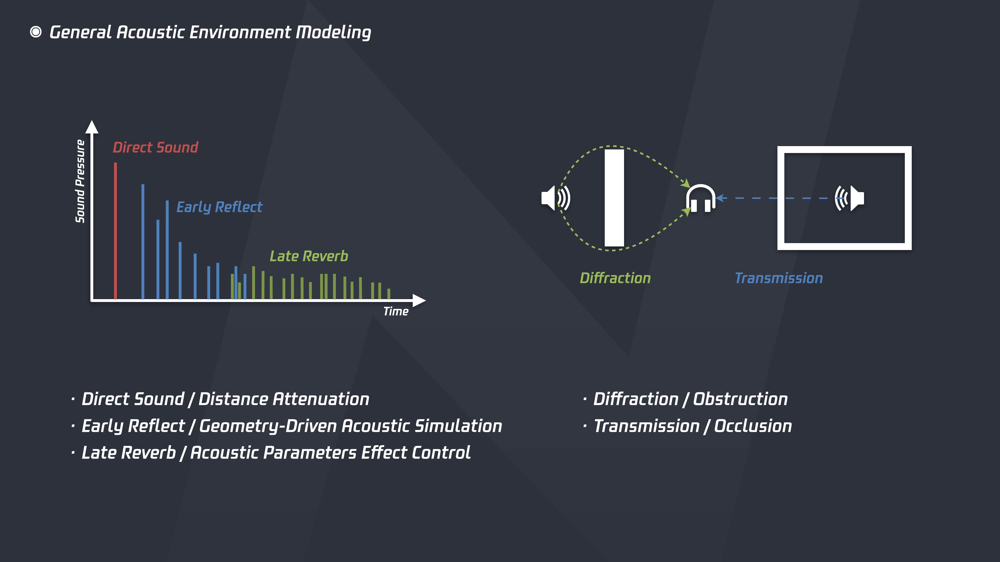
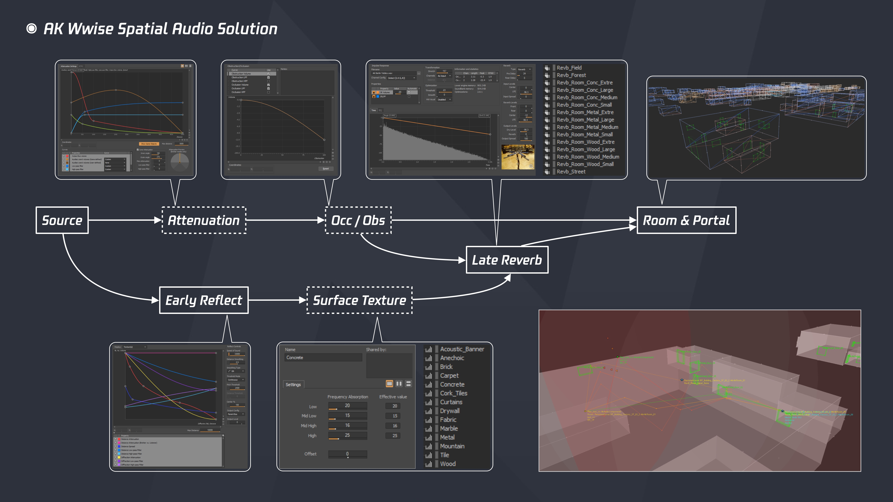
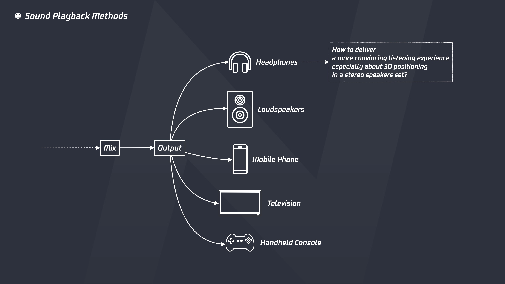

# 展望游戏音频设计的发展方向

***

<!-- Start Document Outline -->

* [游戏音频设计的现状](#游戏音频设计的现状)
* [程序化音频（Procedural Audio）](#程序化音频procedural-audio)
* [声学环境建模（Acoustic Environment Modeling）](#声学环境建模acoustic-environment-modeling)
* [空间声与双耳声音频（Ambisonics &amp; Binaural Audio）](#空间声与双耳声音频ambisonics--binaural-audio)
* [再创造，而非纯模拟（Recreation，Not Simulation）](#再创造而非纯模拟recreationnot-simulation)

<!-- End Document Outline -->

***

今年年中的时候，与朋友做了一期名为[《2020了，游戏还能给我们带来什么》](https://m.ximalaya.com/yule/40134221/319415380)的播客节目，作为一个坚定的技术派，我在其中表达了一个观点，新体验的产生很大程度上依赖于硬件性能的提升和开发工具的进化。如果把问题具体到游戏音频设计，我认为值得展开讨论的话题就是，基于硬件软件不断发展的前提下，游戏音频设计自身会发生哪些变化，从业者在开发流程中会运用哪些新的方法，玩家在游戏过程中能获得哪些新的体验。  
最初在列文章大纲时起的英文标题是“What will The Next Gen of Game Audio Design be like”，这是一个疑问句，对此我并没有清晰明确的答案，所以说我只能是结合实际工作中遇到的痛点，来聊一聊游戏音频设计在设计思路、开发工具和终端体验等各个环节上还有哪些可以改进的地方。译成中文的话，就高大上一点地叫“展望游戏音频设计的发展方向”吧。

## 游戏音频设计的现状

1983年，任天堂推出了风靡全球的 Nintendo Famicom，经典配色的“红白机”。这算是我最早认识的游戏机了，就把它作为标尺来分析一下硬件性能：8-bit 1.79MHz 处理器，2KB 内存，音频方面支持 4-bit 波表合成器和最高 7-bit 15.7458kHz 采样文件，最多可同时播放五个声音。2013年，Sony 推出了 PlayStation 4 主机，而它的性能已经达到了：八个 64-bit 1.6GHz 处理器，8GB 内存，24-bit 48KHz 音频文件格式成为开发标配，八通道输出支持多种环绕声音响设置，可同时发声数方面也没有了硬性限制。  
显而易见，这三十年的硬件发展是非常迅速的，性能水平的提升几乎是以百千倍计的。而就在我写这篇文章的时候，Sony 和 Microsoft 也都相继推出了新一代的游戏主机，性能方面更是有了进一步的提高。

另外值得一提的是，移动端设备的性能也已经到了非常高的水准，越来越多的游戏开始尝试主机端和移动端的多平台支持了。虽然由于手机本身的功能定位和物理机能的限制，在实际表现上与主机相比还有些差距，但是游戏开发的思路和目标在这两个平台之间并没有明显的差异，只是各有不同的侧重而已：主机端追求的是在极限的性能要求下达到最极致的表现，而移动端则更注重在保证尽可能好的表现下去适配更广泛的机型。  
总的来说，就从内存和处理器这两个指标来理解，硬件性能的提升对游戏音频设计意味着：更大的内存意味着可以使用更多高质量的声音资源，更快的处理器意味着可以处理更多高精度的实时控制。

因此在这样的硬件性能水平之下，游戏音频设计也形成了目前一套相对成熟的开发流程，借用[《游戏音频设计的工作流》](The-Workflow-of-Game-Audio-Design.md)一文中的图示来说明：在数字音频工作站（Digital Audio Workstation）中制作出高质量的声音资源（Sound Asset，通常以 wav 格式文件为主），导入音频中间件（Audio Middleware）中进行统一管理和进一步处理，并与游戏引擎（Game Engine）深度结合来构建实现逻辑（Implementation Logic），最终以音频数据（Audio Data，以 AK Wwise 为例即 Event）的形式与游戏中其它元素配合来实现各种丰富的条件触发和实时变化。

以上，就是从硬件性能和开发流程这两个角度入手，简单阐述了一下游戏音频设计的现状是怎样的。接下来我将以三个在实际项目中遇到的例子，来聊一聊游戏音频设计目前尚存的一些问题，以及可行的改进方案。

## 程序化音频（Procedural Audio）

在第三人称射击游戏类型中，玩家能够清楚地观察到整个角色的各种行为，因此角色在动作表现上的细节就显得尤为重要，特别对于写实风格的游戏来说更是如此。针对此类角色动画的开发需求，目前常见的做法是基于骨骼动画（Skeleton Animation）和关键帧动画（Keyframe Animation）的。以 Unreal Engine 为例，首先根据角色表现进行细致的行为分类，比如基础的 Idle、Turn、Walk、Run 以及各种行为之间起停和过渡等行为，通过动作捕捉（Motion Capture）的方式采集原始动作素材并制作出大量的动画序列（Animation Sequence），再在游戏引擎中运用混合空间（Blend Space）和状态机（State Machine）等功能对动画序列进行整合，实现各种行为的触发和转换。在这样的开发工序下，角色衣服和脚步等 Foley 相关的声音一般是以动画通知（Animation Notify）的形式整合进动画序列中，只要动画序列被触发，其中相应的声音就会被播放。

接下来就以脚步声为例来具体分析一下到底需要准备多少声音资源。通常有以下几个重要因素需要考虑：  
* 歩态：与动画行为分类相关联，如走、跑、跳、落地、起停等，如果更细致一些还可以考虑各种步态在前后左右行进方向上的差异，比如向前走和向后退在脚跟脚尖的着地顺序上是不同的；  
* 体型：主要是由体型等相关因素引起的脚步声在整体听感上的差异，比如通常会有男女之分，女性的脚步声可以显得更轻盈一些；  
* 鞋子：穿着拖鞋、皮鞋、运动鞋和登山靴等不同鞋子所发出的脚步声有各自明显的特点，具体种类取决于角色换装的丰富程度；  
* 材质：角色处在水泥、沙石、草地等不同材质上发出的脚步声有明显差异，具体种类一般由游戏中定义的物理材质所决定。  
* 素材变化：即每一个种类的脚步声需要制作多少个随机样本，以保证在高频率触发的情况下不会出现明显的重复感。

根据上述考量因素可以制定出整体所需的数据结构和资源规模。以我们目前一个项目为例来进行估算，一个男性角色的动画序列数量超过了1500个，其中男性脚步声数据使用到的声音资源文件数量超过了5000个。

上述这种制作方式可以称为是 Sample-Based Asset Production，即声音资源的来源是海量的音频格式文件，最终的声音效果很大程度上也取决于这些资源本身的质量。梳理一下这种制作方式的特点，以及我对它的一些想法：  
1. 角色的前进后退和快走慢跑等行为在声音上的细微差别真的可以体现出来吗？优秀的拟音师确实可以表演出这些动作之间的细微差异，并以录音的形式明确细致地记录下来。也正是如此，使用样本资源是目前最主要也最有效的制作方式。  
2. 声音表现的丰富程度和细节变化重度依赖于声音资源的数量。通过细分行为结构和堆叠海量数据的方式，确实可以把细节品质推到极致，但在资源有限的实际开发环境下，如此巨大的工作量往往是无法承受的。  
3. 这种工作量是贯穿在整个工作流程中的，包括声音资源制作、数据结构搭建、音频数据整合等。通过规范化流程和自动化工具确实可以减少其中一部分的重复劳动，提高生产效率，比如对动画序列进行检测并在脚着地时刻自动添加音频数据，但是这并没有从根本上改变整个生产方式的核心思路。  
4. 在此基础上，可以引入游戏中的动态参数对声音资源做进一步的实时处理，比如使用角色的速度和斜率参数对同一资源的响度、音调和低通/高通滤波等属性进行实时调节，来模拟在不同坡度上行进的脚步声变化。但是这种实时调节的效果只能算是一种低精度的模拟，因为对这些音频属性的调整并不能改变样本自身的波形特征，换句话说就是不能体现出动作本身之间的真实差别。  

归根结底，这种 Sample-Based 的制作方式其实是试图用足够多的离散数据去匹配高精度的连续变化，在我来看这其中是有很大的改进空间的。游戏开发的技术性特点是所有逻辑都是构建在程序算法之上的，所有表现其实是演算过程的结果，自然地也就有了程序化生成（[Procedural Generation](https://en.wikipedia.org/wiki/Procedural_generation)）这个概念，简单来说就是通过算法来生成数据。这种思路在游戏开发领域也早有应用，比如开发世界大规模地形和植被的生成、Roguelike 类游戏随机地图的生成等，近几年比较出名的游戏作品《No Man’s Sky》中甚至生成了超过18000000000000000000（Quintillion，18个0）个独特的星球可供玩家探索。  
说回到我们的例子上，即使是在基于大量动画序列的角色动作制作流程中，其实多少也会涉及到程序化动画（[Procedural Animation](https://en.m.wikipedia.org/wiki/Procedural_animation)）的相关运用，比如角色在死亡或失去控制之后进入的 [Ragdoll 状态](https://en.wikipedia.org/wiki/Ragdoll_physics)，使用 [Inverse kinematics](https://en.wikipedia.org/wiki/Inverse_kinematics) Rig 让角色在与其它物体接触时的动作表现更加自然，采用 [Motion Matching](https://www.gdcvault.com/play/1023280/Motion-Matching-and-The-Road) 方式来更方便快捷地实现角色 Locomotion 行为等。而现在甚至已经可以运用人工智能、神经网络等相关技术，在不依赖于动画序列等数据的前提下，让角色产生非常自然且自适应各种状态的动画表现。  
试想今后在这样的工作流程中，现有形式的音频数据都没有类似于动画序列这样的载体去依托，我们又该如何去设计和整合角色的动作声音呢？因此相对应地在音频设计领域，自然也会有程序化音频（Procedural Audio）的设计思路。

程序化音频这个概念虽然不是一个新事物，但是目前在业界似乎还没有大规模的讨论与应用，甚至都还没有相应的 Wiki 页面。在此我暂且不对程序化音频的学术定义展开讨论，仅结合上述角色脚步声设计的案例，来梳理一下我对程序化音频的理解，以及实际运用的可行性思路：  
1. 首先，程序化音频的思考重点是物体为什么发声和怎么样发声，而不是简单地只考虑具体的声音表现。如果从相对宽泛的尺度下去考量，现在的游戏音频设计其实已经包含了许多程序化音频的设计思路。在[《游戏音频设计的一种思路：解构与建模》](A-Thought-of-Designing-Sound-in-Game-Deconstruction-and-Modeling.md)一文中我也表达过类似的想法。  
2. 有一点需要明确的是，程序化音频并不是说要完全抛弃样本素材的使用，这一点与物理建模声音合成（[Physical Modelling Synthesis](https://en.wikipedia.org/wiki/Physical_modelling_synthesis)）是有本质区别的。基于物理模拟的声音合成是指对物体的物理属性进行解构并通过算法建模的方式来生成声音，学界在这方面已经有了多年的研究和成果，之后是有机会作为程序化音频设计思路中的一项技术而被实际运用在游戏音频设计工作流中的。但就目前的实际开发而言，使用样本素材的方式在声音质量、运算速度和性能消耗等各个方面都还是有绝对优势的。  
3. 引入程序化音频设计思路的主要目的是，使用有限的声音资源来实现尽可能丰富且动态的声音表现。在目前的游戏音频设计工作流中许多方法其实是与此契合的，比如使用来自引擎中的动态参数来实时调制声音的属性，这仍然会是程序化音频中的一个重要手段。  
4. 对于角色脚步声设计中的步态因素而言，我认为目前运用程序化音频最主要的障碍是还没有一个有效的模型从更为解构的角度去描述脚步的结构与状态。比如平台解谜游戏《Inside》里的角色脚步声设计就做了一次有趣且成功的尝试，将脚步声拆分成脚尖（Toe）和脚跟（Heel）两部分，然后通过角色速度等参数来实时控制这两部分的播放间隔、响度和音调等属性，来无缝衔接地表现角色在不同速度下行进的脚步声。尽管这种解构模型的精度还是相对简单，但是对像《Inside》这类横版移动和艺术化美术风格的游戏类型来说确实已经足够而且是有效的。而对于写实风格的第三人称射击游戏来说，我们在脚步声解构模型上还需要有更进一步的思考与探索。  
5. 材质（Material）是游戏引擎中一个基础且重要的系统，目前在音频设计方面对其的应用还是比较简单和直接的，即一种材质映射一组包含若干随机变化的样本素材的声音，这也是脚步声的声音资源数量和结构复杂程度会随着材质种类的增加而成倍扩大的主要原因。如果引入程序化音频的设计思路，我们可以从材质的硬度、厚度和粗糙度等物理属性去分析，并结合物理建模声音合成的技术，这样就可以使用尽可能少的声音资源通过参数控制和排列组合的方式去实现尽可能多的材质声音表现。  
6. 最后，从务实的角度来讨论一下为什么程序化音频还没有被大规模地运用在实际开发中。我认为可能的原因有二：一是，目前绝大多数游戏类型的开发规模和资源数量还是可控的，使用样本素材是最为直接有效且相对廉价的制作方式。受限于人员技术背景和人力成本等因素，游戏音频团队投入时间精力去从事程序化音频的基础研究或许不是一件划算的事情；二是，尽管学界可能在相关领域已经有了研究进展和成果，但由于缺少实际需求的驱动，因此还没有形成一个相对完整的解决方案。  

## 声学环境建模（Acoustic Environment Modeling）

在强竞技的写实风格射击游戏中，玩家对声音的关注点不仅仅是枪声听起来爽不爽，更会对枪械射击和人物动作等声音的空间感和方位感提出更高的要求，因为这些声音在符合物理常识和听觉习惯的情况下能够给玩家提供更多的战局信息。所以在游戏音频设计中，我们需要解决的一大问题就是如何在游戏世界中重建一个拟真的声学环境，让声音在其中传播时听起来真实可信。  
声学环境建模本身就是学术研究中的一大方向，在建筑声学等领域已经有了非常多的研究成果和实际应用，我在这方面没有任何的研究经验，因此仅从游戏音频设计的角度来讨论一下目前常见的解决方案。

首先从响度的角度来考虑，一个声音在从激发到消失的过程中可以被分为三个部分，即直达声（Direct Sound）、反射声（Early Reflect）和混响声（Late Reverb），这三部分声音会以动态地生成、变化和混合，来形成声源在空间中的整体效果。同时考虑声音在传播过程中的两个行为特征，衍射（Diffraction）与透射（Transmission），这两者与空间的几何体（Geometry）信息是强相关的，需要配合听者（Listener）与声源（Emitter）的空间信息和相对关系共同参与运算。简单理解，以上五点就是在游戏中重建声音传播（Sound Propagation）现象时可以被设计和控制的要素。

以音频中间件 Audiokinetic Wwise 的 [Spatial Audio](https://www.audiokinetic.com/products/wwise-spatial-audio/) 解决方案为例，游戏音频设计师可以从以下几个方面入手：  
1. 在 Wwise 中对各类声音定义不同的 Attenuation 设置，其中包含了声音可传播的最大距离以及基于距离变化的响度、低频和高频的衰减曲线，主要定义的是直达声这一部分的传播属性。另外还会包含声音在不同距离上响应混响效果的曲线，后续被用于混响声部分的计算。  
2. 在 Wwise 中创建 Auxiliary Buss，并在各条 Buss 上配置不同效果的 Reverb 插件来模拟不同空间的混响效果。这些 Buss 之后会被映射到引擎中所定义的空间中以确定各自不同的混响属性，并实时计算生成混响声的部分。  
3. 在 Wwise 中创建 Reflect Buss，通过 Reflect 插件来完成反射声部分的实时计算。反射声是由引擎中所定义的建筑或物体表面反射引起的，与空间几何紧密相关，因此 Reflect 插件中定义了反射声的最大响应距离以及基于距离变化的响度、低频和高频的衰减曲线等属性。  
4. 在 Wwise 中创建各种 Acoustic Texture，用来模拟不同材质对反射声的吸收程度。这些 Texture 之后会被映射到引擎中所定义的建筑或物体表面上，配合 Reflect 插件共同实现更精细的反射声效果。  
5. 在 Wwise 中设置全局的 Obstruction 和 Occlusion 曲线，分别对应衍射和透射的效果。直达声在传播过程中，遇到表面边缘发生转折和直接透过墙体时会分别引起不同程度的 Obstruction 和 Occlusion 计算，得出的数值会在 Attenuation 设置的基础上进一步影响直达声的响度以及低频和高频的衰减。  
6. 在引擎中根据地形和建筑物模型来定义各个 Room，并在其中配置相应的 Reverb Buss、Acoustic Texture 和墙体 Occlusion 等空间属性，以及在门窗等空间开口处定义 Portal 当作声音传播的通道。定义空间主要有两种方式：一是使用 Spatial Audio Volume 组件手动绘制立方体之类的简单几何图形，二是使用 Geometry 组件直接调用建筑物模型的 Static Mesh 信息。  
7. 在完成以上这些设计与整合工作之后，引擎就可以根据听者、声源与几何体的空间信息和相对关系进行实时运算来模拟各类声音在不同空间中的听感效果。

以下是我对上述这种解决方案的理解：  
1. 从对声学环境建模的角度来看，这种方案是建立在 Room & Portal 基础上的，将游戏空间划分为一个个相对独立的 Room，并通过 Portal 将其连接起来。虽然建模精度有限，但这种简化了的模型在实际表现上确实是有效的，在尽可能降低性能消耗的同时也能够体现出声音传播的特点。  
2. 尽管这种建模与还原是有效的，但是与真实的声音表现相比还是有很大差距的，我认为主要瓶颈还是在于性能有限。比如，混响声其实是由无数漫反射混合形成的效果，但在实际开发中我们还无法从这个更本质的角度去进行模拟，大量的射线检测（[Raycasting](https://en.wikipedia.org/wiki/Ray_casting)）极耗性能，只能通过混响插件来实现，而插件本身对混响的建模也是简化的，即使是使用效果更好的卷积混响（[Convolution Reverb](https://en.wikipedia.org/wiki/Convolution_reverb)），目前也存在可控动态参数有限的问题。  
3. 再比如，目前我们通常只能用简单几何体去近似拟合，也不会对所有材质表面都定义反射属性，更不会对所有声音都进行反射计算。而真实环境中声音的细节表现，恰恰就体现在这些无序的、不规则的声音相互影响之中的。  
4. 也正是因为性能有限，这种方案需要人工定义 Room 和 Portal，且对于复杂模型还需要考虑组合拼接，从工作量的角度来看也是一个不小的人力成本。  
5. 当然，这种由于性能有限而引发的还原精度降低和工作成本增加的现象，其实在游戏开发中是普遍存在的，比如对模型设置 LOD（[Level of Detail](https://en.wikipedia.org/wiki/Level_of_detail)）来调整不同视距下的模型精度等。

那除了等待硬件性能提升之外，我们能不能换个思路来解决游戏中声学环境建模的问题呢？  
Microsoft 在2011年提出了一种叫做 [Wave Acoustics](https://www.microsoft.com/en-us/research/publication/sound-synthesis-crackdown-2-wave-acoustics-games/) 的模拟方法，用一种类似于光照烘焙（Static Light Baking）的思路，将复杂环境中声波传播的真实效果进行演算并记录下来，并从中提取重要参数用于设计控制和实时运算。这种方法以不依赖于大量射线检测的方式提高了声学环境的模拟精度，同时也省去了音频设计师手动定义 Room 和 Portal 的大量工作。当然，这种方案目前也存在一些需要改进的地方，比如如何进一步减少烘焙文件的存储大小和如何实现空间信息动态变化等问题。  
目前此方案正式命名为 [Project Acoustics](https://docs.microsoft.com/en-us/gaming/acoustics/what-is-acoustics)，并已在《Gear of War》、《Sea of Thieves》和《Borderlands 3》等项目中经过验证，感兴趣的朋友可以前往官网查阅详情，或者直接试用 Unreal 或 Unity 整合方案。  
限于本人研究深度有限，暂且不论 Room & Portal 和 Wave Acoustics 这两种方案孰优孰劣，至少作为一线工作者是非常乐于见到新技术的出现的，不断从实现效果和工作效率上带给我们新的可能。

## 空间声与双耳声音频（Ambisonics & Binaural Audio）

目前主机平台上的大多数游戏都会按 5.1 环绕立体声以上的重放标准来进行最终的混音，而绝大多数玩家是没有这样规格的重放条件的，主要还是以双声道立体声音箱、耳机甚至只是电视机扬声器居多。因此，无论我们在音频实现上采用了多么先进的技术，或是在混音阶段使用了多么高端的环境与设备，最终都要考虑一个非常重要且实际的问题，那就是如何保证玩家在规格各异的终端设备上也能听到高质量的声音重放效果。那么耳机作为一个大多数玩家都能获取的设备，因而也就成了我们的研究重点，值得去研究如何在耳机上实现一个更加立体且逼真的听觉效果。

针对这个问题，我们首先要理解目前游戏中是如何处理声音定位（Sound Positioning）的。在游戏的三维世界中，听者与各个声源都有各自的坐标，任意两者之间的相对关系经过向量计算便可得出，基于听者而言的声音定位信息是简单且明确的。这种处理方式与游戏开发中基于对象的编程逻辑类似，也可以理解为是 [Object-Based Audio](https://blog.audiokinetic.com/working-with-object-based-audio/)。游戏本身的动态和交互特点，要求声音必须包含完整的定位信息用于实时计算，因此在游戏开发阶段，我们更多考虑的是听者与声源之间相对关系的变化，而非特定声道上具体的重放内容，这一点与音乐和电影等基于声道（Channel-Based）的声音制作思路是完全不同的，我认为也是其优越性的体现。正是因为 Object-Based Audio 具有这样的特点，[Dolby Atmos](https://en.wikipedia.org/wiki/Dolby_Atmos) 等环绕声技术也引入了类似的设计思路，用于实现更丰富立体的电影声音重放效果。  
尽管 Object-Based 的方式保留了声源完整的空间信息，我们最终还是要把声音映射到只有两个声道的耳机上进行重放，目前最常见的方式是 VBAP（[Vector-Based Amplitude Panning](https://en.wikipedia.org/wiki/Amplitude_panning)）。VBAP 的优点在于无需对声场做额外改动就能映射到各种声道配置的重放系统上，然而它的缺点也是明显的，玩家听到的并不是真正的全方位的声场，声源相对于听者在前后方向和高度上的差异被压缩了，直观地来说就是原本的三维空间被压扁成了一个二维平面。  
所以对于上述耳机重放的问题，我们可以结合两种技术来有针对性地解决，先是使用空间声（[Ambisonics](https://en.wikipedia.org/wiki/Ambisonics)）技术将声源的空间信息映射到一个立体的球形声场中，然后再使用双耳声音频（Binaural Audio）中的头部相关传递函数（HRTF，[Head-Releated Transfer Function](https://en.wikipedia.org/wiki/HRTF)）对球形声场中的声源进行滤波处理，最终实现空间感更加准确且适合耳机重放的声音定位效果。

对此我的理解是：  
1. Ambisonics 早在70年代就已发明，只是因为此前 Channel-Based 的制作方式占据主流，导致其没有太大的用武之地。直到前几年 Virtual Reality 的兴起，Ambisonics 对整体声场捕捉和还原的特点才重新被人重视，Ambisonics 话筒配合全景摄像机的拍摄方式很好地顺应了 VR 影片的制作需求。  
2. 在游戏音频设计中，Ambisonics 的应用远不止是使用话筒采集 Ambisonics 声音素材，更重要的是 Ambisonics 可以作为一种中介空间表示法（[Intermediate Spatial Representation](https://www.audiokinetic.com/products/ambisonics-in-wwise/)）来模拟声场，为后续使用 HRTF 进行更精准的双耳化定位提供了可能。目前音频中间件 Audiokinetic Wwise 也已将 Ambisonics 整合进自身已有的 Spatial Audio 工作管线中。  
3. Binaural Audio 也不是一个新技术，Binaural Recording 录音方式早已出现且被广泛使用，现在流行的所谓 [ASMR](https://en.wikipedia.org/wiki/ASMR) 视频其实就是使用 Binaural 话筒录制来营造一种更亲近的听觉体验而已。其原理非常简单易懂，就是在靠近人耳鼓膜附近布置话筒或者使用人工头模型话筒来录制声音，这样就能把声音受耳道、耳廓、头型和躯体等部位的影响更精确地捕捉下来，而人之所以能辨别声音方位，与受到这些部位的滤波影响而产生细微变化有很大的关系。  
4. 在游戏音频设计中，Binaural Audio 的应用也远不止是使用 Binaural 话筒采集声音素材，最主要的是我们能从以这种方式将人体部位对声音的滤波影响提取成 HTRF，这样就可以对游戏中实时变化的声音进行双耳化处理。  
5. 目前 HRTF 数据采集需要在高标准的声学环境下使用话筒阵列来进行，费时费力成本高，因此常规的 HRTF 数据只能对有限样本进行采集再处理成笼统的分类预设。然而由于个体器官构造的差异性，这些数据无法精确地匹配到每一个个体。所以，如何更方便快捷地采集个人 HRTF 数据可能会是之后值得探索的一项技术。

总之，耳机是目前普通消费者体验高质量声音表现最易获取的设备，针对耳机的声音重放体验肯定会受到越来越多的重视，因此在开发阶段专门针对耳机重放做特殊的声音定位和混音处理也是尤为必要的。

## 再创造，而非纯模拟（Recreation，Not Simulation）

上述三个例子分别从资源生成、声学建模和终端体验三个角度展开，讨论了游戏音频设计的发展方向和进展，也从都侧面反映了对技术进步的一致要求：设计工具更可控（Controllable），运算性能更快速（Fast），呈现效果更精确（Accurate）。这可能多少回答了开头的问题，What will the next gen of Game Audio Design be like，至少算是一个相对明确的技术要求。  
上文通篇都是对技术本身的讨论，其重要性不言而喻，但是纯粹追求技术手段的发展更多属于科学研究的范畴，而游戏音频设计是技术与艺术的结合，技术手段要服务于艺术表达，游戏作品的好坏最终取决于玩家的体验和评价，而非技术手段的先进与否。  
科学研究的技术成果提供了模拟（Simulation）现实的工具，而游戏开发者则应该思考如何将这些工具运用到虚拟世界的再创造（Recreation）中去。当技术发展到能让我们越来越接近真实的时候，我们又该如何去定义虚拟世界中的“真实性”呢？

希辰  
2020.12.13

***